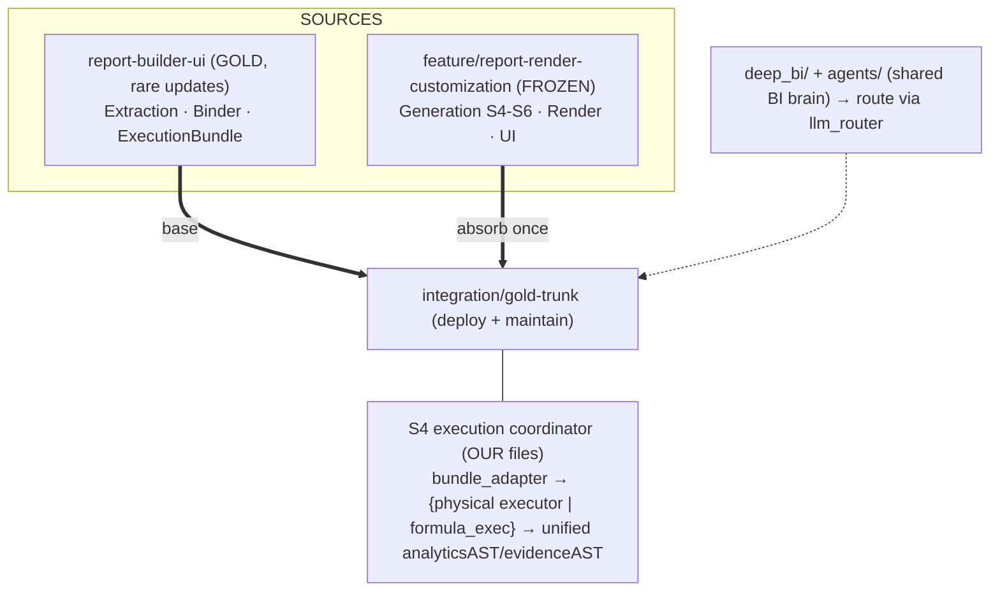
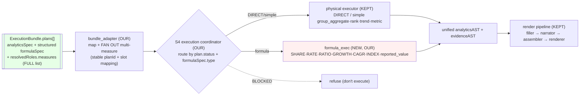

# Gold Integration Plan v6.2 — Frozen Render ⟶ New Trunk, Gold-Conformed to Team Binder/Extraction

> **Status:** DRAFT v6.2 — friend critique rounds 1–4 folded in & verified in source. Repo-facing docs are credential-free and self-consistent. No branches/source changed.
> **Author:** GitHub Copilot (analysis agent). **Reviewer:** friend agent — *r2 caught the self-contradiction; r3/r4 caught the cleanup items.*
> **Date:** 2026-06-10. **Repo:** Madan94/statathon.
> **Untracked working doc.** Companion: `TEAM_HANDOFF_REQUEST.md`.
> **Inputs folded in:** team handoff + 15 new commits + friend critique r1 (§0z) + r2 (§0y) + **r3/r4 cleanup (§0x)**, each point verified in source.

> **§0x. Round-3/4 cleanup (v6.1→v6.2), verified:** (r3) Phase 3 denominator → BLOCKED-not-degrade; Phase 0a → "no
> source/history writes"; A5 → `/execution-ready` freezes (not finalize); risk title → v6; reviewer agent tools →
> `[read, search]`; credentials removed from §0a/R11. (r4) residual credential *meta-references* tightened; `SKILL.md`
> Phase-0a wording matched; §0z #8 marked **superseded** by §0y; §18.2 dropped "linear history" (it conflicted with the
> `--no-ff` merge model) and now **allows merge commits**; §18.4 CI **path filters expanded** to api/dashboard/generation/
> render/fixtures. *(r4 point 1 — "credentials still in §0a" — was already fixed in v6.1: §0a reads "authenticated `gh`
> CLI"; the residual mentions were only meta-notes, now also removed.)*

---

## 0y. Adjudication of the friend's round-2 critique (verified)

Round 2 was right that **v5 accepted the executor conclusion at the top but left stale v3/v4 contradictions below**.
Verified and fixed. Verdict: **all 8 directives accepted** (one with a sharpened nuance from the code).

| # | r2 point | Verdict | Action in v6 |
|---|---|---|---|
| 1 | v5 still says "expression engine" in §1.3/§1.5/§4.2/§4.3/§15/§17 | **ACCEPT** | Purged every instance; §1.3 now states physical-column truth; §1.5 diagram redrawn; §15 A0 deleted; §17 rewritten. |
| 2 | "FEL before executor" under-specified/possibly wrong for group quotients | **ACCEPT** | Replaced with an **S4 execution coordinator** (two paths) — §3. Renamed C-rev → **C-native**. |
| 3 | Missing denominator must be `BLOCKED/NOT_READY`, not a runnable degrade | **ACCEPT (verified, my v5 was wrong)** | `readiness_gate.py` ~L150: SHARE/RATE/RATIO empty `denominatorColumn` → `severity=error` → `BLOCKED`, bundle `NOT_READY` ("THIS IS A BLOCKING ERROR"); CAGR-no-timeWindow & INDEX-no-baseValue likewise. FEL **refuses BLOCKED plans**; §10 rewritten. |
| 4 | `reported_value` needs deterministic semantics | **ACCEPT** | §3.3 now: 1 non-null→use; many identical→use; many different→weighted_mean iff valid `weightColumn` & policy, else **ambiguous/DEGRADED, never silent mean**. |
| 5 | Multi-measure fan-out must preserve component identity | **ACCEPT** | §4 now mandates stable `planId = plan_<qid>__<measure>` + mapping back to `outputContract.components[]`, table colIDs, labels, `lineage.sourceColumnIds`, evidence refs. |
| 6 | Phase 0 "read-only" but writes a failing test = contradiction | **ACCEPT** | Split **Phase 0a (read-only verify)** vs **Phase 0b (test-first, on trunk)**. Never add a failing test to `report-builder-ui`. |
| 7 | Remove credential specifics from repo-facing doc | **ACCEPT** | §11 + §0a now: "use authenticated `gh` CLI; don't change global identity; don't commit creds." No account names or token detail anywhere in this doc. |
| 8 | Update customization (AGENTS.md + skill + reviewer agent) | **ACCEPT** | `AGENTS.md` gets a Gold-integration-invariants section; add `.github/skills/gold-integration/SKILL.md` + `.github/agents/gold-integration-reviewer.agent.md`. |

**Nuance I add (from the code):** the gate blocks a *named-but-absent* OR *empty* denominator for SHARE/RATE/RATIO.
But **GROWTH with missing periods is only `warn → DEGRADED`** (executable), and `reported_value`/`RATE_SUMMED` are
`warn → DEGRADED` too — so the coordinator/FEL still needs graceful handling for *those* (degraded-but-runnable),
while **refusing** the genuinely BLOCKED ones. "Block everything formula-ish" would be wrong in the other direction.

---

## 0z. Adjudication of the friend agent's critique (accept / reject, with proof)

The friend's review was sharp and **mostly correct** — including on the one point that was the spine of v4. I verified
every claim in the actual code before accepting. **Verdict: 6 accepted (verified true), 1 of my own claims retracted,
2 refined, and 2 places where I go deeper than the critique.**

| # | Friend's claim | Verdict | Proof / reason |
|---|---|---|---|
| 1 | **Render executor is *not* expression-based**; `columnExpr` is read as a physical column; `100*weighted_share(...)` is a comment, not executable | **ACCEPT — and I retract my v4 claim** | `executor.py::_agg_value` does `pd.to_numeric(frame[measure])` where `measure = plan.measure.columnExpr`. A real expression string would `KeyError`. There is **no** expression evaluator and **no** numerator/denominator logic. My v3/v4 "adapter translates structured→expression" premise is **falsified**. |
| 2 | **Freeze-key mismatch** — freezes by `datasetAst.signature` (which doesn't exist) but loads by `signature` | **ACCEPT (critical, verified)** | `freeze_store.py::freeze_bundle` L88: `signature = bundle.datasetAst.signature if hasattr(...) else bundle.datasetId`. `DatasetAST` has no `signature` field → always falls back to `datasetId`. `load_frozen_bundle(template_id, signature)` looks up by `signature`; real one is `BindingAST.datasetSignature` (schema L416). Writes and reads use different keys. |
| 3 | **`reported_value` falls through to mean** | **ACCEPT (verified)** | `_agg_value` has no `reported_value` branch → final line `# mean/ratio/default → col.mean()`. Binder emits `agg="reported_value"` for percent/per_1000/index/ratio units → executor silently **averages rates**. |
| 4 | **SHARE/RATE emitted without denominator** | **ACCEPT (verified)** | `question_binder` SHARE/RATE branches set `numeratorColumn=measures[0]` but never `denominatorColumn`. Formula is under-specified; generation must not invent the denominator (contract rule). |
| 5 | **Don't compute row-level ratios then average** (statistically wrong) | **ACCEPT** | `weighted_ratio` does a weighted *mean* of the measure column; `mean(row_ratios) ≠ Σnum/Σdenom`. Must aggregate numerator & denominator at the grain, then divide. |
| 6 | **Energy fixture too weak for formula proof; add synthetic fixtures** | **ACCEPT** | Energy mostly exercises DIRECT + multi-measure rendering; it does not prove SHARE/RATE/CAGR/INDEX math. Added Phase 7 synthetic fixtures. |
| 7 | **Freeze happens at `/execution-ready`, not `/finalize`** | **ACCEPT (refines my wording)** | `/execution-ready` → `build_execution_bundle` → `freeze_bundle`; `/finalize` returns coverage only. My v3 "finalize emits bundle" was imprecise. |
| 8 | "Fix freeze/load contract **first** (Phase 0), before merge" | **SUPERSEDED by §0y/Phase 0a–0b** | Original refinement is obsolete: Phase 0a is **read-only/no source writes**; the *failing* regression test is added **only on `integration/gold-trunk`** in Phase 0b/2, never on the team branch. The freeze-key fix lands on the trunk + change-note (C7). |
| 9 | "Render planner takes `roles.measures[0]`" (multi-measure dropped) | **ACCEPT the symptom, go DEEPER** | True that `analyticsSpec.measure` collapses to `measures[0]` — but this happens in the **binder** (team), and the **full list survives in `plan.resolvedRoles.measures`**. So our adapter can **fan out** one plan → N `AnalyticsPlanRec` without touching team code or losing data. Simpler than WIDE_TO_LONG for already-separate columns (energy's Proved/Indicated/Inferred/Total). |
| 10 | "Implement formula-aware execution" (general) | **ACCEPT, and SHARPEN** | Not one mechanism but **three**: row-level derivations (DIFFERENCE, INDEX-vs-base) → `DERIVE_COLUMN` pre-step; group-level quotients (SHARE/RATE/RATIO) → aggregate num+denom separately then divide; time formulas (GROWTH/CAGR) → aggregate at period grain then apply. See §3.3. |

**My own correction (the friend surfaced it):** render's `AGG_FUNCS = (weighted_ratio, mean, sum, median, count,
ratio, min, max)` — so the executor **does** support `sum`/`median`/`count`/`min`/`max`. My v4 §4.2 "sum not in
render" was **wrong**; only `reported_value` is genuinely missing.

**Net effect on the plan:** the central work is **not** an expression-translating adapter (v4) but **an adapter +
a real Formula Execution Layer (FEL)** that the frozen executor lacks. This is bigger and is now the spine (§3, Phase 3).

---

## 0a. What changed from v3 → v4 (the recent pull, retained)

Fetched origin via the authenticated `gh` CLI. **The team pushed 15 commits** (`a6583d9 → 4e99d36`, +11,082/−417);
local team branch fast-forwarded cleanly (no push, reversible). **Render branch unchanged** (still frozen `4e4d7ce`).
**Zero overlap with generation/render** — the team stayed entirely in their lane. Material effects:

1. **The extraction→binding handoff is no longer "manual" (§3 Gap-1 softened).** New `tests/test_extraction_binder_e2e.py`
   (10/10) proves the deterministic chain `blueprint+dataset → resolve_entities → bind_questions →
   compile_execution_plans → validate_execution_ready → ExecutionBundle`.
2. **The adapter contract is now EXACT (§4).** I read `question_binder.compile_execution_plans` — the precise
   `analyticsSpec` shape, the `operation`/`agg` vocabularies, and the `formulaSpec` inference are now known.
3. **Offline crash mitigated (R4↓).** New `table_candidate_adapter.py` (TC1) wraps the `document_map=None` path in
   try/except → returns `[]` instead of crashing. (Still verify before relying on live extraction.)
4. **Gold fixture exists but no frozen bundle (by design).** `gold_standard/energy.template.{ast,blueprint}.json`
   + `energy.diagnostics.json` (binder-readiness **0.92**) are committed; the `ExecutionBundle` is built at runtime,
   not serialized. → **We generate + freeze one in Phase 2.5** as our acceptance artifact.
5. **OpenRouter is in (§9, E1).** `llm_router`'s `openai` provider speaks the OpenAI wire format → covers
   OpenRouter/DeepSeek/Together/Ollama. `MODEL_PROFILE=openrouter_cheap_dev`; route via `llm_text_call(prompt, task=…)`.
6. **StatisticalContext still has no CV/MoE (§9 unchanged)** — but extraction now computes a *richer*
   `MoSPIStatisticalContext` that is **under-propagated** into the blueprint (only `sourceDocument`+`domain` mapped).

---

## 0. What changed from v2 → v3 (retained for history)

The team's handoff answers + my code verification **upgraded this from a hypothesis to a specified design**. Five
material changes:

1. **The adapter is now fully specifiable AND bigger than a renamer (§3, §4).** I read the real
   `QuestionExecutionPlan` / `FormulaSpec` / `NormalizationPlan` and the frozen render `executor.py`. The team's
   plans are **structured** formulas (`type=SHARE, num, denom, multiplier`); the render executor is
   **expression-based** (it expects derived-measure expressions like `100 * weighted_share(...)`). **The adapter
   is a formula *translator*, and a few formula types likely need targeted executor extension.** This is the new
   spine of the work.   *[v5 note: this v3 belief was later FALSIFIED — see §0z #1.]*
2. **StatisticalContext correction (§9).** Verified: it has **no CV/MoE/design-effect/weights** fields (only
   `unitRegistry`, `sourceNotes`, `footnotes`, `estimateStatus`, `referenceDate`, `geographyLevel`, `timeCoverage`,
   `surveyRound`). So my v2 "MoSPI weighting/precision" enhancement was **premature** — dropped. *(Weighted
   aggregation does exist, but at `FormulaSpec.weightColumn`, not in StatisticalContext.)*
3. **E2E must start from the GOLD BLUEPRINT, not live extraction (§7 Phase 2).** Team confirms offline
   `LLM_DISABLED=1` extraction crashes after Pass 2.6 (`document_map=None`). So the testable seam is
   **binding → bundle → generation**, seeded from `energy.template.blueprint.json`.
4. **Readiness + provenance are now concrete (§9, §10).** READY/DEGRADED/NOT_READY policy is defined; the render
   `ProvenanceDrawer` gets wired to `lineageIndex`.
5. **LLM conformance is concrete (§9).** `llm_router.llm_text_call` + `llm_disabled()` (first-class) exist. The BI
   audit's "no LLM_DISABLED flag" simply means `deep_bi` **bypasses** the router. Conformance = route
   `deep_bi`/generation narration through the router.

---

## 1. Verified context (measured from git + code + team handoff)

### 1.1 Branch facts
| Fact | Value |
|---|---|
| Merge-base | `9534e27` (2026-06-09) |
| **OURS** `report-builder-ui` (team gold) | 75 commits / 143 files — Extraction E0–E12, Binder, Runtime R0–R8 |
| **THEIRS** `feature/report-render-customization` @ `4e4d7ce` (FROZEN) | 18 commits / 69 files — Generation S4–S6, Render, Render UI |
| Files changed by **both** | **`.gitignore` only** |
| Team binding-contract edits | 1052 insertions, **0 deletions** (additive) |

### 1.2 Verified contract spine (read in `execution_contracts.py`, confirms team draft)
- **`QuestionExecutionPlan`**: `planId, questionId, questionText, status(EXECUTABLE|DEGRADED|BLOCKED),
  analyticsSpec(dict — RESOLVED real columns), sourceAnalyticsSpec(dict — audit only), resolvedRoles, normalizationPlan,
  formulaSpec, outputContract(dict), evidenceRequirements(dict), lineage(LineageRef), diagnostics[]`.
- **`ResolvedRoles`**: `measures[], dimensions[], filters[ResolvedFilter], time(ResolvedTime)`.
- **`ResolvedFilter`**: `column, op, value, filterApplied` (`false` = default value couldn't be safely applied → widened/degraded).
- **`FormulaSpec.type`** ∈ `{DIRECT, SHARE, RATE, GROWTH, CAGR, INDEX, RATIO, DIFFERENCE}` + `numeratorColumn,
  denominatorColumn, timeWindow, weightColumn, multiplier, unitConversion, baseValue`. **`weightColumn` exists** →
  weighted aggregation is modeled here.
- **`NormalizationPlan.type`** ∈ `{NONE, WIDE_TO_LONG, PIVOT, JOIN, UNION, FILTER_ROWS, DERIVE_COLUMN}`.
- **`StatisticalContext`**: `geographyLevel, timeCoverage, unitRegistry, sourceNotes, footnotes, estimateStatus,
  surveyRound, referenceDate`. **No CV / MoE / design-effect / survey-weight fields.**
- **`LineageRef`**: `sourceQuestionId, sourceEntityIds[], sourceColumnIds[], sourceTableId, headerPaths[][],
  transformations[]`. **`ExecutionBundle.lineageIndex` = `{questionId: LineageRef}`.**
- **`llm_router.py`**: `llm_text_call` (L538), `llm_vision_call` (L650), **`llm_disabled()` (L272, first-class)**.

### 1.3 Verified render executor capability (read frozen `generation/executor.py`)
- `plan.operation` ∈ `{group_aggregate (default), rank, trend, metric}`.
- `AGG_FUNCS = {weighted_ratio, mean, sum, median, count, ratio, min, max}` (weighted ones use a weight column).
- **Physical-column model, NO expression evaluator (verified):** `_agg_value` does `pd.to_numeric(frame[plan.measure.columnExpr])`
  — it aggregates **one physical column**. A formula string like `100*weighted_share(...)` would `KeyError`. There is
  **no** numerator/denominator math, **no** CAGR/INDEX, **one** measure per plan, and **`reported_value` falls through
  to `mean()`**. ⇒ the formula computation does not exist and must be built (see §3).

### 1.4 Owner + team decisions (locked)
| # | Decision |
|---|---|
| D1 | Render branch **frozen** — we enhance its code only on the new trunk. |
| D2 | New branch = **central integration point + deploy/maintain trunk**. |
| D3 | Team gold = foundation; future updates **rare**; team publishes handoff `.md` then **largely stops**. |
| D4 | **Touch team extraction/binding only if mandatory** (error/required). Prefer adapters our side. |
| D5 | Untrack `api/statathon.db` + gitignore `*.db` **approved**; keep `storage/bindings/demo__*` as fixtures. |
| D6 | Team's researched **extraction→binding handoff** is the gold spec. |
| **D7 (new)** | **Consume `ExecutionBundle`, not raw binding internals.** Blueprint only for render/output fallback. Honor readiness. Use `lineageIndex` for provenance. Route all model calls through `llm_router`. Keep guardian tests green. Don't assume live extraction matches gold — use diagnostics. |
| **D8 (new)** | **Do-not-touch:** binding execution-contract fields, gold fixtures/tests, freeze-store semantics, value-free validators, `ExecutionBundle` schema. |

### 1.5 Mental model
Team gold (Extraction + Binder) is the **living foundation**; it emits a rich validated **`ExecutionBundle`** as the
official S4 handoff. The frozen render donor has the **report/BI product** (Generation + Render + UI) but its executor
is **physical-column-based** and **bypasses the bundle**. We stand up a **new trunk** (base = team gold), absorb the
render donor once, then route generation through an **S4 execution coordinator** that consumes the bundle and computes
the missing formula algebra — keeping the render pipeline (S5/S6) intact — and enhance from there.



---

## 2. Objectives & constraints

**Objectives:** (1) stand up the trunk; (2) **gold-conform generation** (consume `ExecutionBundle`); (3) enhance
BI/render/UI/connectivity; (4) maintain cheaply.

**Constraints:** C1 never push/rewrite source branches · C2 no rebase of published history · C3 no destructive git
on shared refs without go-ahead · C4 touch team code only if mandatory (D4) → prefer our-side adapters · C5 every
phase has a gate + rollback · **C6 (new)** never weaken guardian tests (D7) · **C7 (new)** respect the do-not-touch
list (D8); if a genuine team-side bug blocks the trunk, **patch + document + notify**, and for contract-breaking
changes raise a change-note first.

---

## 3. 🔬 THE CENTRAL FINDING — bundle bypass + a missing Formula Execution Layer

### 3.1 The two gaps (Gap-2 re-diagnosed per §0z #1)
**Gap 1 — handoff bypass:** team binding emits a validated `ExecutionBundle` ("the S4 team's ONLY input
contract"); render generation ignores it and re-derives plans from the flat stash.

**Gap 2 — the executor has no formula algebra (the hard one, corrected from v4):**
- **Team plans are structured:** `formulaSpec{type:SHARE, numeratorColumn, denominatorColumn, multiplier, weightColumn}`
  + `normalizationPlan{type:WIDE_TO_LONG, …}`. Rule: *"S4 must not infer formula semantics; S3 expresses them."*
- **Render executor is physical-column-based, NOT expression-based** (verified §0z #1): `executor.py::_agg_value`
  does `frame[plan.measure.columnExpr]` — it aggregates **one physical column**. The `100*weighted_share(...)` string
  is a **comment describing intent**, never evaluated. No numerator/denominator math, no CAGR/INDEX, no multi-measure;
  `agg="reported_value"` silently falls through to `mean()`.

So conforming generation to gold is **not** "translate a formula into an expression string" (v4 was wrong — there is
nothing to evaluate the string). It is **build an S4 execution coordinator** that consumes the bundle and routes each
plan to the right computation, **fan out multi-measure plans**, and **keep** the proven render *pipeline* (S5/S6).



### 3.2 Decision: Option **C-native** (bundle adapter + S4 execution coordinator + formula_exec)  🔬 CRITIQUE-BAIT
| Option | What | Verdict |
|---|---|---|
| A — shallow | keep flat-stash + render's own re-derivation | ❌ stays non-gold; duplicated S4 logic drifts. Temp baseline only. |
| B — full rewrite | replace render S4 *and* its output assembly with a brand-new executor | ❌/later — biggest blast radius; discards render's tested output shapes. |
| **C-native — coordinator + formula_exec (RECOMMENDED)** | adapter maps + fans out; a thin **coordinator** routes DIRECT/simple plans to the kept physical executor and formula plans to a new `formula_exec`; both emit the **same** `analyticsAST`/`evidenceAST` shapes; S5/S6 render pipeline untouched | ✅ gold conformance + correct stats; new logic in **our** files; preserves render output contract & pipeline. |

**Why C-native (renamed from v5's "C-rev"):** the friend correctly noted that "FEL strictly *before* the executor" is
wrong for **group-level quotients** — a SHARE/RATE result is a *grouped* value, so `formula_exec` must **produce
grouped output directly** (it can't just hand a column back to the physical executor). So the honest architecture is a
**coordinator with two execution paths** that converge on one output shape — not a linear pre-processor. **Why not A:**
ships a product wrong by contract *and* statistically. **Why not B:** the render *output assembly* (aggregation rows,
ranking items, evidence tokens) is good and tested; only the *formula math* is missing, so we add that path and reuse
the rest. Escalate to B only if `formula_exec` ends up duplicating most of the executor's output assembly.

### 3.3 The execution strategies — grain-correct, with deterministic semantics
Routing is keyed by **`plan.status` first, then `formulaSpec.type`** (status gate per §10):

| class | types | gate | method |
|---|---|---|---|
| **refuse** | any `plan.status == BLOCKED` | hard | do **not** execute; carry the readiness reason into the report (§10) |
| **physical** | `DIRECT` (+ simple `group_aggregate/rank/trend/metric`) | run | kept physical executor (plain agg of `columnExpr`) |
| **row-level** | `DIFFERENCE(a−b)`, `INDEX(val/base)` | run | materialize a derived column (`DERIVE_COLUMN`) **before** aggregation |
| **group-quotient** | `SHARE`, `RATE`, `RATIO` | run only if denom present (else BLOCKED upstream) | `multiplier · agg(num)/agg(denom)` **at the group grain** — **never** `mean(row_ratios)` |
| **time** | `GROWTH`, `CAGR` | run (GROWTH-missing-periods arrives DEGRADED — handle) | `GROWTH=(cur−prior)/prior·mult`; `CAGR=(end/start)**(1/n)−1` |

**Deterministic `reported_value` (per output group) — fixes the `mean()` fallthrough (§0y #4):**
```text
non-null values in group:
  exactly one      → use it
  many, all equal  → use that value
  many, differing  → if a valid weightColumn exists AND policy permits → weighted_mean
                     else → mark AMBIGUOUS → DEGRADED (never silently average)
```
**Hard rule:** SHARE/RATE/RATIO aggregate numerator & denominator at the *same* grain, then divide.
**Status discipline (§0y #3, verified):** the readiness gate already marks a missing/absent denominator (SHARE/RATE/RATIO),
missing CAGR `timeWindow`, and missing INDEX `baseValue` as **`error → BLOCKED → NOT_READY`**. The coordinator **must
not** soften these to a runnable degrade — it refuses them. It only *gracefully handles* the cases the gate leaves
**runnable** (DEGRADED: GROWTH-missing-periods, `reported_value` ambiguity, `RATE_SUMMED`). Fixing the *binder* to emit
a denominator is a **team change-note** (C7), never our silent patch.

---

## 4. The gold adapter + coordinator — VERIFIED spec (OUR files)

**Files (ours):** `report_builder/generation/bundle_adapter.py` (plan mapping + measure fan-out) and
`report_builder/generation/formula_exec.py` (the FEL). **Signature:**
`bundle_to_planrecs(bundle) -> list[AnalyticsPlanRec]` (+ pass `statisticalContext`/`lineageIndex` downstream).

### 4.1 The EXACT binder output (read from `question_binder.compile_execution_plans`, L300–450)
Each `QuestionExecutionPlan.analyticsSpec` is:
```python
{
  "operation": "group_aggregate" | "rank" | "share" | "growth" | "cagr" | "index" | "ratio" | "rate",  # from blueprint; default "group_aggregate"
  "measure":  {"column": <real col>, "agg": "sum"|"mean"|"reported_value", "unit": <unit>},
  "groupBy":  [{"column": <dim>}, ...],
  "filters":  [{"column", "op", "value"}, ...],
  "sort":     {"by": "measure", "order": "desc"},
  "topN":     <int|null>,
  "time":     {"column": <col>, "periods": {"current", "prior"}}   # optional
}
```
Plus a **structured** `formulaSpec.type ∈ {DIRECT, GROWTH, SHARE, RATE, CAGR, INDEX, RATIO}` (DIFFERENCE in enum, not
auto-emitted), with `numeratorColumn/denominatorColumn/multiplier/timeWindow/weightColumn/baseValue`, **and**
`plan.resolvedRoles.measures` = the **FULL measure list** (the analyticsSpec collapse to `[0]` is recoverable here).
**MoSPI nuance the binder encodes:** `unit ∈ {percent,per_1000,index,ratio}` + `agg=="sum"` → `agg="reported_value"`
(you cannot sum rates). The execution side **must honor this** with deterministic `reported_value` semantics (§3.3).

### 4.2 The VERIFIED mismatch (binder vs frozen render executor) — corrected
| dimension | binder emits | render executor actually has | coordinator/formula_exec action |
|---|---|---|---|
| **operation** | `group_aggregate, rank, share, growth, cagr, index, ratio, rate` | `group_aggregate, rank, trend, metric` | DIRECT/simple → physical executor; `share/ratio/rate/growth/cagr/index` → `formula_exec` (§3.3) |
| **agg** | `sum, mean, reported_value` | `weighted_ratio, mean, sum, median, count, ratio, min, max` (**`sum` IS supported**) | pass `sum`/`mean` through; **`reported_value` → deterministic semantics** (§3.3), never `mean()` |
| **formula** | structured `formulaSpec` | **none** — `frame[columnExpr]` physical lookup, no evaluator | **`formula_exec` computes** the math (no string translation; the executor has nothing to evaluate it) |
| **measures** | `analyticsSpec.measure` = `[0]`; full list in `resolvedRoles.measures` | one `plan.measure` per plan | **adapter fans out** → N plans with **stable identity** (§4.4) |
| **normalization** | `normalizationPlan{WIDE_TO_LONG,PIVOT,JOIN,UNION,DERIVE_COLUMN,FILTER_ROWS}` | none | implement **safe subset** NONE/WIDE_TO_LONG/DERIVE_COLUMN/FILTER_ROWS; **block** JOIN/UNION/PIVOT → DEGRADE (Phase 4) |

### 4.3 Field map (grounded)
| render `AnalyticsPlanRec` need | gold source | note |
|---|---|---|
| measures | `resolvedRoles.measures` (full) → fan out | `analyticsSpec.measure` alone loses the rest |
| dimensions | `analyticsSpec.groupBy[].column` / `resolvedRoles.dimensions` | 1:1 |
| filters | `analyticsSpec.filters` (render wants expr strings like `"age>=15"`) | format `{column,op,value}` → `"col op value"`; `filterApplied=false` → DEGRADED + caveat |
| time/periods | `analyticsSpec.time` / `resolvedRoles.time` | drives trend + GROWTH/CAGR windows |
| operation | `analyticsSpec.operation` (+ §3.3 routing) | taken from plan, not guessed |
| agg | `analyticsSpec.measure.agg` | `reported_value` → deterministic (§3.3) |
| derived result | `formulaSpec{type,num,denom,multiplier,weightColumn,baseValue,timeWindow}` | **computed by `formula_exec`** (§3.3), not a string |
| normalization | `normalizationPlan` | safe subset pre-step |
| chart/topN/sort | `analyticsSpec.sort/topN` → `outputContract` → blueprint `answerStructure.components` | display owned by blueprint |
| provenance | `lineage(LineageRef)` + `bundle.lineageIndex` | feeds `evidenceAST` + ProvenanceDrawer |
| caveats | `status`, `diagnostics`, `filterApplied` | §10 |

### 4.4 Multi-measure fan-out MUST preserve identity (§0y #5)
Fanning out is necessary but **not sufficient** — each fanned plan needs a stable id and a mapping back to its render
slot, or values compute correctly but **land in the wrong table column/chart series**:
```text
questionId            q_coal_composition_category
fanned planIds        plan_q_coal_composition_category__proved_reserves
                      plan_q_coal_composition_category__indicated_reserves
                      plan_q_coal_composition_category__inferred_reserves
each fanned plan carries → outputContract.components[] ref · table column ID · measure label
                          · lineage.sourceColumnIds (its own column) · evidence ref
```


**Wiring:** `generate_phase_api` **prefers** the frozen bundle (`build_execution_bundle` / `load_frozen_bundle`) →
`bundle_adapter` → **S4 coordinator** (physical executor | `formula_exec`) → unified `analyticsAST`/`evidenceAST` →
kept `filler → narrator → assembler → renderer`. Keep the legacy flat-stash path behind a flag (Option-A fallback).

> **No expression-engine assumption remains:** the executor is physical-column-based, so `formula_exec` is required
> (it computes the math directly). The only open sizing question is *how much* of `normalizationPlan` energy needs in
> practice — answered by the Phase 7 run, not by guesswork.

---

## 5. Strategy & 6. Branch model (unchanged from v2, condensed)

- **Absorb** render with one `--no-ff` recursive merge (textually trivial: only `.gitignore`). **Conform** via the
  C-native adapter + S4 coordinator + `formula_exec` on our side. **Maintain** by absorbing the team's rare top-ups.
- Rejected: rebase (C2; 18 replays), cherry-pick (loses provenance; tempts editing team branch), subtree/submodule
  (cuts live `report_builder.*` imports), squash (loses S4–S6 / R-phase granularity).
- **Branch:** `integration/gold-trunk` (name TBD, Q9), **based on team gold**, render merged in. Rationale: deploy-trunk
  lineage reads as "gold pipeline + product on top"; trunk is a **superset of the living foundation**; rare team
  top-ups become near-fast-forward. (Content is identical regardless of base; only first-parent lineage differs — O1
  reversible before push.)

---

## 7. Phased execution plan (restructured per the friend's staging + my gates)

Each phase: **Objective · Steps · Gate · Rollback.** PowerShell-correct (`;`). Nothing pushed until §11. The friend's
sequencing — *fix the contract, then consume the bundle, then fix the executor, then multi-measure, then provenance,
then LLM, then fixtures* — is clearer for the formula work, so I adopt it, wrapped in my gate/rollback discipline.

### Phase 0a — Safety net + read-only verification (no source/history writes, §0y #6)
**Steps:** `git fetch --all --prune`; create local tags `preint-team report-builder-ui`, `preint-render feature/report-render-customization`
(local refs only — they touch no source files, branches, or published history, and are reversible with `git tag -d`);
re-verify clean tree (don't bulk-commit unrelated dirty files); re-measure overlap (⊆ `.gitignore`); **inspect** the
freeze-key bug (`freeze_store.py` keys by `datasetAst.signature`→`datasetId`; load by `signature`) and **record the
finding** — no test written yet (that's Phase 0b/2, on the trunk).
**Gate G0a:** tags exist; tree clean; overlap ⊆ `.gitignore`; freeze-key finding recorded. **Rollback:** `git tag -d preint-*` (no source/history touched).

### Phase 1 — Create trunk + absorb render (mechanical merge only)
**Steps:** `git switch -c integration/gold-trunk report-builder-ui`; `git merge --no-ff feature/report-render-customization`;
resolve `.gitignore` by **union**; artifact reconciliation (D5): `git rm --cached api/statathon.db` + gitignore `*.db`;
keep `storage/bindings/demo__*` fixtures; decide `.vscode/mcp.json`; register `generate_phase_api` router in
`api/main.py` if missing. **Keep flat-stash files as operational lookup only, not semantic truth.**
**Gate G1:** clean merge except `.gitignore`; backend imports with both binding + generation routers.
**Rollback:** `git switch report-builder-ui; git branch -D integration/gold-trunk` (unpushed, disposable).

### Phase 0b/2 — Test-first freeze-key fix + bundle consumption (ON TRUNK only)
**Objective:** generation consumes the bundle, not a rebuilt `BindingAST`; the freeze round-trip is green. **All writes
happen on `integration/gold-trunk`, never on `report-builder-ui` (§0y #6).**
**Steps:**
1. **Test-first (now on trunk):** add the *failing* regression test — freeze a bundle, then
   `load_frozen_bundle(template_id, BindingAST.datasetSignature)` and assert round-trip (documents §0z #2). Red.
2. **Fix the freeze key** (the C7 "mandatory" exception — it blocks reproducibility): key freeze/load by
   `BindingAST.datasetSignature`, not `datasetAst.signature`/`datasetId`. **Document + notify the team** (their file,
   D8); offer the patch back as a change-note. Test → green.
3. **Build `bundle_adapter.py`** (§4): `ExecutionBundle.plans → list[AnalyticsPlanRec]`; honor readiness (§10);
   `sourceAnalyticsSpec` audit-only; **fan out multi-measure** with stable identity (§4.4).
4. **Rewire `generate_phase_api`** from `stash→rebuild BindingAST→re-bind→re-plan` to `load/build ExecutionBundle →
   adapt → coordinator → generate`. Keep the legacy path behind a flag (Option-A fallback).
**Gate G2:** freeze round-trips by `(template_id, signature)`; a test proves `analyticsAST.plans[]` are **bundle-sourced**
(operation/agg match the plan, not re-derived). **Rollback:** flag back to legacy path; trunk still runs.

### Phase 3 — Build `formula_exec.py` + the S4 coordinator (the real gap §3.3)
**Objective:** compute the team's formula algebra correctly — the executor only does physical-column aggregation.
**Steps:** implement, with a synthetic test per type (Phase 7):
- **row-level:** `DIFFERENCE`, `INDEX(val/base)` → materialize via `DERIVE_COLUMN`, then aggregate.
- **group-quotient:** `SHARE/RATE/RATIO` → `multiplier · agg(num)/agg(denom)` at the group grain (**never** average
  row ratios). A missing denominator is already **BLOCKED** by the readiness gate (§10) and is **not executed**; if
  `formula_exec` sees it defensively, **refuse and surface the contract/readiness error — never degrade it** into
  runnable output (inventing a denominator is forbidden).
- **time:** `GROWTH=(cur−prior)/prior·mult`; `CAGR=(end/start)**(1/n)−1`.
- **passthrough:** `reported_value` → take the reported figure (no averaging); `DIRECT` → plain agg.
**Gate G3:** synthetic tests pass for every `FormulaSpec.type`; `reported_value` no longer averaged.
**Rollback:** per-formula feature flags; unsupported types DEGRADE rather than mis-compute.

### Phase 4 — Multi-measure + safe normalization
**Objective:** stop dropping measures; reshape correctly.
**Steps:** adapter fan-out (or `WIDE_TO_LONG` for table shape) so energy's Proved/Indicated/Inferred/Total all render;
implement the **safe** normalization subset `NONE / WIDE_TO_LONG / DERIVE_COLUMN / FILTER_ROWS`; **explicitly block**
`JOIN / UNION / PIVOT` (DEGRADE with a clear reason) until secondary-data/join semantics are proven.
**Gate G4:** energy fixture renders **all** expected measure columns, not just the first. **Rollback:** block→DEGRADE.

### Phase 5 — Provenance + statistical-context propagation
**Objective:** audit-ready output. **Steps:** thread `bundle.lineageIndex` + executor `rowIds` into `evidenceAST` and
the `ProvenanceDrawer` (questionId → entities → columns → table/headerPaths → transformations → rowIds); propagate the
**supported** `StatisticalContext` fields (`unitRegistry`, `sourceNotes`, `footnotes`, `timeCoverage`, `geographyLevel`,
`referenceDate`) into captions/notes — and the under-propagated extraction context (§0a #6). **Do not invent CV/MoE.**
**Gate G5:** a rendered value traces back to bundle lineage + source rows; notes/caveats visible. **Rollback:** per-field.

### Phase 6 — LLM governance
**Objective:** all model calls obey runtime rules. **Steps:** no direct Gemini/OpenAI/Groq SDK calls in changed
generation/BI/agents paths — route via `report_builder.llm_router.llm_text_call/llm_vision_call` (inherits
`llm_disabled()` + OpenRouter `openrouter_cheap_dev`). `LLM_DISABLED=1` ⇒ no network calls, deterministic
planner/narrator, offline tests pass.
**Gate G6:** grep shows no direct SDK usage in changed paths; offline generation works. **Rollback:** per-call-site.

### Phase 7 — Golden + synthetic fixtures, acceptance (the friend's key add)
**Objective:** prevent false confidence. **Steps:** **(a) Energy E2E fixture** under `tests/fixtures/gold_e2e/energy/`
(`template.ast.json`, `template.blueprint.json`, `dataset.csv`, `v1.bundle.json`, `v1.binding.json`,
`report.output.ast.expected.json`) — proves *product flow*. **(b) Formula contract fixtures** — small synthetic
datasets for `SHARE, RATE, RATIO, DIFFERENCE, GROWTH, CAGR, INDEX, WIDE_TO_LONG, multi-measure, reported_value` —
prove *math*. Run all guardians (`test_extraction_gold`, `test_extraction_binder_e2e`, `test_binding_contracts`,
`test_template_compiler_wrapper`, `test_template_emit`) + `test_generation_*` + `test_render_*` with
`LLM_DISABLED=1`. **Gate G7:** bundle-sourced generation, formula correctness, multi-measure rendering, readiness
blocking, and provenance all proven green.

### Phase 8 — Enhancement (after G7 green)
- **BI (deep_bi/agents):** route through `llm_router`; `RetrievalAgent` timeouts + circuit breaker; surface
  silent-retrieval failures in `context_used`; kill the analytics-error→1-line fallback; de-hardcode synonyms; evidence de-dup.
- **Render/UI:** chart density rules; MoSPI subtotals/footnotes; LaTeX/Tectonic hardening; bilingual labels; SSE
  reconnect; optimistic block edits; ProvenanceDrawer depth.
- **Connectivity:** job-cancel endpoint; implement the stubbed binding-override.
**Gate G8 (per PR):** targeted tests + no G2–G7 regression.

---

## 8. The seam — verified dossier
- **(a) imports:** `generation/planner_adapter.py` imports `BindingAST, DatasetAST, QuestionBinding` (additive-safe).
- **(b) gold plan layer:** `ExecutionBundle.plans[QuestionExecutionPlan]` + `statisticalContext` + `readinessReport`
  + `lineageIndex`; built by `execution_bundle_factory.build_execution_bundle()` (wired at `binding_phase_api.py:411`,
  endpoint **`…/execution-ready`** — *not* `/finalize`, §0z #7), frozen to `storage/bindings/{id}__{sig[:16]}/vN.bundle.json`.
- **(c) substrate:** flat stash `storage/bindings/{id}__{sig}.{dataset.json|blueprint.json|data.csv}` (both sides read).
  Team rule: **freeze store = semantic contract; flat stash = operational data/CSV lookup; generation needs both.**
- **(d) signature:** `sha256` over sorted `columnName:dtype`, truncated 16 chars; lives on **`BindingAST.datasetSignature`**
  (NOT `DatasetAST` — the source of the §0z #2 freeze-key bug).
- **Break conditions to hunt:** a team **rename/removal** of a field the adapter reads (additive is safe); a change to
  the **stash filenames / `load_record` signature**. Both caught by G2.

---

## 9. StatisticalContext: what to honor vs NOT build (correction)
**Honor:** `unitRegistry` (labels/formatting) · `sourceNotes`+`footnotes` (provenance/captions) · `estimateStatus`
(quick/provisional/revised/final → captions) · `referenceDate` (table/chart subtitles) · `geographyLevel` (wording) ·
`timeCoverage`/`surveyRound` (headers). **Weighted aggregation** uses `FormulaSpec.weightColumn` (plan-level), which
the render executor already supports (`weighted_mean`/`weighted_ratio`).
**Do NOT build (fields absent):** CV/MoE display, design-effect, survey-weight suppression thresholds. If the product
needs these, **file a contract request** to the (stopped) team — don't invent semantics.

## 10. Readiness policy (generation gate) — verified semantics (§0y #3)
The coordinator routes by **`plan.status` first** (the readiness gate already decided fate):
- **`readinessReport.status == NOT_READY`** → **block generation by default.** (User may explicitly request partial
  output *only* if the bundle is DEGRADED and policy permits — never for NOT_READY.)
- **`plan.status == BLOCKED`** → **do not execute that plan.** Carry the readiness reason into the report. This
  includes (verified in `readiness_gate.py`): SHARE/RATE/RATIO with missing/absent `denominatorColumn`; CAGR with no
  `timeWindow`; INDEX with no `baseValue`; any missing measure/dimension/filter column.
- **`plan.status == DEGRADED`** → generate **with visible caveats** (sourced from `plan.diagnostics`, `status`,
  `filterApplied=false`). These are the *runnable* warnings: GROWTH-missing-periods, `reported_value` ambiguity,
  `RATE_SUMMED`.
- **`plan.status == EXECUTABLE`** → generate normally.

**Invariant (do NOT violate):** the coordinator must **never downgrade a contract-level `error/BLOCKED` into a runnable
degrade.** It only handles what the gate already left runnable. Inventing a denominator, or averaging an ambiguous
`reported_value`, is forbidden — those are binder change-notes (C7), not silent execution-side fixes.

---

## 11. Push & review · 12. Sustain
- Push `integration/gold-trunk` only after **G2 green**; never push source branches; open a PR; promote to `main`/`prod`
  per Q8b. **Auth:** use an **authenticated `gh` CLI** for fetch/push; **do not change the global git identity**; **never
  commit credentials.**
- **Sustain (simplified by D3, validated today):** the team's first top-up was a **clean fast-forward** (15 commits,
  0 conflicts, zero generation/render overlap) — evidence the lane model holds. Loop: `git fetch origin` →
  `git merge origin/report-builder-ui` (near-FF) → **G2 tripwire** (import smoke + fastest generation/render tests +
  `test_binding_contracts` + the **§4 field-map check**, so a silent contract drift fails loudly). Pin
  `binding.executionBundle.v1`.

---

## 13. Risk register (v6 — re-diagnosed after the executor + readiness-gate reads)
| ID | Risk | Lk | Impact | Mitigation | Detect |
|---|---|---|---|---|---|
| **R0 (TOP)** | Render executor has **no formula algebra** (physical-column only); SHARE/RATE/RATIO/GROWTH/CAGR/INDEX uncomputed | High (verified §0z #1) | High | Build `formula_exec` + S4 coordinator (§3.3); synthetic test per type (Phase 3/7) | G3/G7 |
| **R0b (CRITICAL)** | **Freeze-key bug** — freezes by absent `datasetAst.signature`→`datasetId`, loads by `signature`; reproducibility broken | High (verified §0z #2) | High | Fix key to `BindingAST.datasetSignature` on trunk + change-note (C7); test-first (Phase 0b/2) red→green | G2 |
| **R0c (HIGH)** | `reported_value` silently averaged (binder emits it for rates) | High (verified §0z #3) | High | Deterministic `reported_value` (§3.3); never `mean()` a rate | G3 |
| **R1 (HIGH)** | Multi-measure questions render only `measures[0]`, or land in wrong slot | High (verified §0z #9 / §0y #5) | High | Adapter **fan-out** with **stable identity** (§4.4) | G4 |
| R2 | Coordinator softens a contract `BLOCKED` (missing denom/timeWindow/base) into a runnable degrade | Med | High | **Refuse BLOCKED plans** (§10, verified gate); binder fix = team change-note | G7 |
| R3 | Statistically-wrong group ratios (averaging row ratios) | Med | High | FEL aggregates num+denom at grain then divides (§3.3) | G7 synthetic |
| R4 | `normalizationPlan` JOIN/UNION/PIVOT unsupported/unsafe | Med | Med | Implement safe subset; **block** unsafe → DEGRADE | G4 |
| R5 | Energy fixture too weak to prove formula math | High (friend) | Med | Add synthetic per-formula fixtures (Phase 7) | G7 |
| R6 | Field the adapter reads renamed post-handoff | Low (D3) | High | §4 field-map tripwire; version pin; D8 | Sustain |
| R7 | `LLM_DISABLED` incomplete in render scribe/narrator | Med | Med | Route via `llm_router` (`llm_disabled()`); deterministic fallbacks | G6 |
| R8 | Interface-seam files (`api/main.py`, `dashboard/lib/api.ts`, binding `page.tsx`) need manual reconcile | Med | Med | Region review in Phase 5 | G5 |
| R9 | Tempted to edit team schema/contract to fit render | Med | High | C4/C7/D8; FEL on our side; change-note | review |
| R10 | Committing unrelated dirty files / `api/statathon.db` | Med | Med | Clean-tree G0; untrack DB G1; no bulk commit | G0/G1 |
| R11 | Git auth / push failure | Med | Low | Use authenticated `gh` CLI; retry; never change global identity or commit creds | §11 |

---

## 14. Open questions (most resolved by team draft)
**Resolved:** ExecutionBundle is gold (A1) · QuestionExecutionPlan spec (A2) · presentation hints in
outputContract→analyticsSpec→blueprint (A3) · StatisticalContext fields + no CV/MoE (A4) · readiness policy (A5) ·
lineageIndex shape (A6) · storage duality (B1) · signature algo (B2) · template_id sourcing (B3) · handoff flow (C1) ·
blueprint shape (C2) · DatasetAST/ColumnProfile (C3) · risk codes (C4) · golden fixture location (D1) · guardian tests
(D2) · llm_router usage (E1) · LLM_DISABLED contract (E2) · ownership + do-not-touch (F) · dirty files (G1/G2) ·
artifacts (G3) · branch logistics (G4).
**Still open:** **Q-A1b** confirm `ExecutionBundle` fields are *frozen* (not just current) at `…v1`. **Q-R0** which
`formulaSpec.type`s must be supported for v1 of the trunk (can CAGR/INDEX wait?). **Q-B1b** is the flat stash
*guaranteed* written alongside the frozen bundle at finalize? **Q9** trunk name. **Q8b** who reviews trunk→`main`/`prod`.

## 15. Assumptions register
| ID | Assumption | If false | Confidence |
|---|---|---|---|
| A1 | Overlap ⊆ `.gitignore` at merge | manual conflict | High |
| A2 | Team stops / updates rarely | revert to daily sync | Med-High |
| A3 | Binding contracts stay additive at `…v1` | adapter+escalate | High |
| A4 | Flat stash + `load_record` stable | IO seam breaks | High |
| A5 | `/execution-ready` builds/freezes the bundle (finalize returns coverage only) | build bundle on demand via factory | High (verified) |
| A6 | E2E works from gold blueprint without live extraction | need a service run | High (team-confirmed crash path avoided) |

## 16. Definition of done
Trunk up (G1–G3 green, pushed, PR open) · gold-conformed (E2E trace proves bundle-sourced plans; every required
`formulaSpec.type` tested) · golden bundle fixture committed · sustain tripwire wired · enhancements per-PR on green.

## 17. 🔬 What the friend agent should attack (v6)
1. **§3.2 C-native boundary:** is the **S4 coordinator with two execution paths** the right cut, or does `formula_exec`
   end up duplicating enough of the physical executor's output assembly that a clean **native S4 executor (B)** is
   simpler? Where exactly is that line?
2. **§3.3 grain correctness:** is the row-level / group-quotient / time split complete? Any `formulaSpec.type` that
   needs a 4th strategy (e.g. weighted SHARE combining `weightColumn` *and* num/denom)?
3. **§10 status discipline:** have I drawn the BLOCKED-vs-DEGRADED line exactly where the gate does? Is there a case
   the gate leaves EXECUTABLE that the coordinator should still refuse (or vice-versa)?
4. **§4.4 identity:** is `plan_<qid>__<measure>` + component/colID/label/lineage mapping enough to guarantee values
   land in the right slot, or do charts (series order) need more?
5. **Sequencing:** should the `llm_router`/`LLM_DISABLED` hardening (Phase 6) move *before* Phase 7 so the offline
   acceptance run is trustworthy? Or before Phase 2 to de-risk every test?
6. **Native S4 vs render-output reuse:** the physical executor emits gold `aggregations/rankings/trends/metrics` with
   `rowIds`. Should `formula_exec` reuse those exact builders (DRY) or stay independent (decoupled)? Trade-off?
7. **Missing risks:** two agents on the trunk concurrently; secrets in the committed `.db`; no CI for generation yet;
   golden/synthetic fixtures drifting vs. the evolving `report.output.ast.json` schema.

---

## 18. Branch lifecycle — initiation ⟶ deploy ⟶ perpetual maintenance

The goal: stand up `integration/gold-trunk` **once**, make it the **deploy branch**, and run a **repeatable, gated
loop** so every future change from the source branches is analysed, merged correctly, verified, and shipped — without
ever destabilising the trunk or the team branch.

### 18.1 Initiation (one-time)
1. **Phase 0a–1** (above) create the trunk locally: tag both sources, merge render donor in, reconcile artifacts.
2. **Publish:** push the trunk to origin **only after G2 green** (so collaborators never see a broken trunk):
   `git push -u origin integration/gold-trunk`.
3. **Open a tracking PR** `integration/gold-trunk → main` (kept open as the promotion path; not merged until §18.2 gates pass).

### 18.2 Make it the deploy branch
- **Branch protection on the trunk** (GitHub settings, request the repo owner to apply): require PR before merge,
  require status checks (the CI job in §18.4), **block force-push and direct push**, dismiss stale approvals, and
  **allow merge commits** (the sync/donor merges use `--no-ff` for provenance — so do **not** enable "require linear
  history"). The team's `report-builder-ui` stays protected too (we never push it).
- **Promotion model (pick one — Q8b):**
  - *(a) Trunk-as-prod:* deploy directly from `integration/gold-trunk`. Simplest; the trunk *is* the release line.
  - *(b) Trunk→main:* trunk is integration/staging; merging trunk→`main` triggers prod deploy. Safer; recommended once stable.
- **Deploy wiring (matches the repo):** the app ships as **ECS task defs** (`deploy/ecs/taskdef-api.template.json`,
  `taskdef-dashboard.template.json`) + the `api` and `dashboard/` Dockerfiles. The deploy workflow builds both images,
  pushes to the registry, renders the task defs, and updates the ECS services. **Secrets via ECS task env / SSM —
  never committed** (honours the `.env*` / `*.db` ignore rules).
- **Release tagging:** every prod deploy tags the trunk (`deploy-YYYYMMDD-<sha>`) so rollback = redeploy a prior tag.

### 18.3 The perpetual maintenance loop (every time a source branch changes)
Run this whenever `report-builder-ui` advances (render is frozen, so it normally won't). **Never merge a source branch
directly into the trunk** — always stage on a throwaway sync branch first.

```text
1. DETECT     git fetch origin
              git log --oneline integration/gold-trunk..origin/report-builder-ui      # what's new
2. ANALYSE    # classify the change + detect contract drift (§18.5)
              git diff --name-only integration/gold-trunk...origin/report-builder-ui
              # lane check: extraction/binding = team truth; generation/render = ours
              # overlap check: anything touching our files? (expect none)
3. REVIEW     run the `gold-integration-reviewer` agent on the diff (read-only gate)
4. STAGE      git switch -c sync/team-YYYYMMDD integration/gold-trunk
              git merge origin/report-builder-ui          # near-FF if lanes held; resolve .gitignore by union
5. VERIFY     $env:LLM_DISABLED='1'; run the tripwire + guardian + generation/render suites (§18.4)
6. PROMOTE    push sync branch; open PR sync/* → integration/gold-trunk; CI must be green; merge --no-ff
7. DEPLOY     promote trunk per §18.2; tag the release
8. ROLLBACK   if anything regresses: `git revert -m 1 <merge-sha>` on the trunk (never reset shared history);
              redeploy the previous deploy-* tag
```

> **Why a sync branch, not a direct trunk merge?** It keeps the trunk always-green and always-deployable: the merge +
> full verification happen off to the side, and only a **green, reviewed** result lands on the trunk via PR. A bad
> upstream change can never leave the trunk in a broken deployable state.

### 18.4 CI for the trunk (extend the existing workflow)
Today `.github/workflows/template-engine-ci.yml` triggers on `main` / `feature/rev-template` and gates
`tests/test_template_engine/` at 70%. Extend it so the trunk is a first-class CI target:
- **Triggers:** add `integration/gold-trunk` to `push.branches` and `pull_request.branches`.
- **Expand `paths`** so integration-critical changes actually trigger CI (the current filter omits api/dashboard/
  generation/render):
  ```yaml
  - 'api/**'
  - 'dashboard/**'
  - 'report_builder/**'
  - 'tests/test_generation*.py'
  - 'tests/test_render*.py'
  - 'tests/fixtures/**'
  - 'test_data/**'
  - '.github/workflows/**'
  ```
- **Add a `generation-render` job** (offline): `LLM_DISABLED=1`, runs the **guardians** + `test_generation_*` +
  `test_render_*` + the **contract-drift tripwire** (§18.5). This becomes a required status check (§18.2).
- Keep the team's template-engine + lint jobs as-is (don't weaken thresholds — C6).
- Keep the team's template-engine + lint jobs as-is (don't weaken thresholds — C6).

### 18.5 The contract-drift detector (the heart of "merged correctly")
A silent rename in a contract file the adapter reads is the one thing that passes a textual merge but breaks gold
conformance. Make it **fail loudly** as a CI test on the trunk:
- **Watch files:** `report_builder/binding/schema.py`, `execution_contracts.py`, `freeze_store.py`,
  `question_binder.py`, and the stash keys in `api/report_builder_api/generate_phase_api.py`.
- **Assert the field-map (§4) still holds:** a test that constructs a known `ExecutionBundle` and asserts the
  `bundle_adapter` reads `operation`, `measure.{column,agg,unit}`, `groupBy`, `filters`, `resolvedRoles.measures`,
  `formulaSpec.{type,numeratorColumn,denominatorColumn,multiplier,timeWindow,weightColumn,baseValue}`, `lineage`, and
  the freeze key `BindingAST.datasetSignature` — by **name**. If the team renames one, this test goes red on the sync
  PR, *before* the merge reaches the trunk. The reviewer agent (step 3) is the human-readable counterpart.
- **On drift:** patch the adapter on our side (C4); if the change is a genuine binder bug/contract break, raise a
  change-note to the team (C7) — never edit the team branch silently.

### 18.6 Cadence & ownership
- **Cadence:** run §18.3 at the start of any work session and before opening a Phase-8 enhancement PR, so enhancements
  always rebase onto fresh gold. The first top-up (15 commits) was a clean fast-forward — evidence the lane model holds.
- **Ownership (Q7):** team owns `report_builder/` extraction + `binding/`; we own `generation/` + `render/` + render UI
  + `deep_bi`/`agents` enhancements. Cross-lane changes get a heads-up. This is what keeps step 4 a near-fast-forward.
