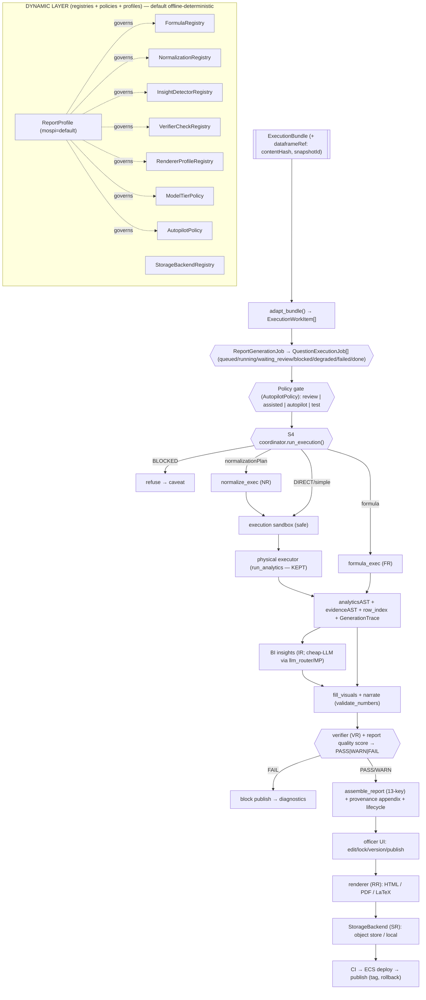

# Post-Binder Execution → Publish Plan (v3) — BharatStat `integration/gold-trunk`

> **Status:** DRAFT v3 — friend round-6 ("dynamic by architecture") folded in + code-verified. Planning only; no code.
> **Author:** GitHub Copilot. **Reviewers:** friend agent (r5 critique, r6 dynamic-architecture). **Companion:** `INTEGRATION_PLAN.md`, `TEAM_HANDOFF_REQUEST.md`.
> **Branch:** `integration/gold-trunk` @ G2. **Every interface, every critique claim, and the reuse targets below were verified in source.**
> **What changed v2→v3:** the system is now **dynamic by architecture** — registries / policies / profiles / pluggable backends instead of scattered MoSPI conditionals; MoSPI becomes a **ReportProfile**, not hardcoded branches. Added a **job model** (extending the existing `ReportJob`+`ProgressBus`, not greenfield), a **report quality score**, a **first-class test/regression harness**, and a **priority + dependency graph** to prevent scope explosion.

---

## 1. Executive verdict on the v2 plan (and the r6 enhancement)

v2 was correct on invariants, the dataset-identity split, refuse-to-guess, the `adapt_bundle` correction, and sandbox
framing. **r6's enhancement is the right next leap and I adopt it fully:** the danger in a v2-style plan is that MoSPI
rules (rounding, denominator handling, chart choice, verifier strictness, model tier) get **hardcoded across modules**.
The fix is an **architecture of registries + policies + profiles**, so behavior is *configured*, not *coded*. Crucially,
the codebase **already has this idiom** — `analytics_engine/router.py` (`resolve_block_analytics` dispatch),
`report_builder/llm_router.py` (provider registry), and `RuntimeConfig` (R0). So registries are **reuse of an existing
pattern**, not a new paradigm. Likewise the "serious job model" already exists as `ReportJob` (DB) + `_run_job`
(BackgroundTasks) + `ProgressBus` (SSE) — we **extend**, not rebuild.

**One discipline I add to r6:** dynamic ≠ infinite config. Every registry ships with a **default offline-deterministic
implementation** and a **frozen `mospi` profile**, so `LLM_DISABLED=1` + no-config still produces the gold output. Config
is an *override surface*, never a *requirement*.

---

## 2. Current-state facts (verified) + assumptions to verify

### 2.1 Verified in code (this session)
| Fact | Evidence |
|---|---|
| `datasetSignature` = **shape only** | `binding/review.py:43-44` — `hash(sorted "name:dtype")` |
| `dataframeRef` = **thin** | `execution_bundle_factory.py:183` — `{"type":"csv","path":...}` |
| executor = **physical-column/pandas**, no formula algebra | `generation/executor.py:272` switch on `operation∈{group_aggregate,rank,trend,metric}` |
| `reported_value` falls through to `mean()` | `executor._agg_value` has no `reported_value` branch |
| DuckDB **not** in generation path | zero `import duckdb` in `generation/**` (sandbox = future gate, not live vuln) |
| `edit.py` already has officer edits + number-override audit + `metadata.version`/`bump_version` | `generation/edit.py:1-20` |
| **Registry idiom exists** | `analytics_engine/router.py::resolve_block_analytics` (dispatch by engine); `llm_router` (provider registry) |
| **Job model exists** | `api/database/models.py:424 ReportJob` (status/stage), `routes.py:624 _run_job` (BackgroundTasks), `progress_sse.py:61 ProgressBus`, resume-from logic |
| G2 API uses **lossy** `bundle_to_planrecs` (drops formulaSpec/lineage) | `generate_phase_api.py` (current) |
| `validate_report` + `validate_numbers` = verifier seeds | `assembler.py:181`, `narrator.py:225` |
| `ProvenanceDrawer` already reads `Provenance{questionId,componentId,analyticsRef,evidenceRef}` | dashboard verified |

### 2.2 Assumptions to verify during implementation
- A PLFS bundle fixture is producible offline (energy confirmed). — verify before W-K two-archetype tests.
- `object_storage/object_store.py` supports R2/S3/MinIO put/get with content-addressing. — verify before W-E full cutover.
- `RuntimeConfig` (R0) is the right host for the new policy keys (or a sibling `GenerationConfig`). — verify before W-O.

---

## 3. Enhanced final architecture diagram



---

## 4. Dynamic / adaptable architecture principles (the r6 core)

**Principle:** behavior is selected by **data (a profile)**, resolved through a **registry**, governed by a **policy** —
never by an `if domain == "mospi"` branch. Each registry is a thin dispatch table (the `analytics_engine/router.py`
idiom), each entry is a small pure function/class, and each ships a **default** + a **`mospi` profile**.

| Registry / policy | Keys → implementations | Replaces the hardcoding of… | Default |
|---|---|---|---|
| `FormulaRegistry` | `DIRECT/reported_value/SHARE/RATE/RATIO/GROWTH/CAGR/INDEX/DIFFERENCE` → handler | formula `if`-ladders | all built-in handlers |
| `NormalizationRegistry` | `NONE/WIDE_TO_LONG/DERIVE_COLUMN/FILTER_ROWS` → transform (`JOIN/UNION/PIVOT`→degrade) | reshape branches | safe subset |
| `InsightDetectorRegistry` | `top_bottom/trend/growth/share/outlier/rank/caveat` → detector | insight `if`-ladders | deterministic detectors |
| `VerifierCheckRegistry` | `provenance/formula_recompute/blocked_absent/caveats/units/content_hash/no_invented_numbers` → check | verifier branches | all checks on |
| `RendererProfileRegistry` | `html/pdf_weasy/pdf_latex` + style → renderer | render-format branches | html default; pdf if engine |
| `StorageBackendRegistry` | `local/s3/r2/supabase` → backend | `storage/bindings` filesystem assumptions | local (dev), object store (prod) |
| `ModelTierPolicy` | task → `{tier0 deterministic, tier1 cheap, tier2 strong, tier3 human}` via `llm_router` | scattered model choices | tier0 (offline) |
| `AutopilotPolicy` | `{mode, confidenceThreshold, allowDegraded, stopOn}` | review/automation branches | review mode |
| **`ReportProfile`** (`mospi`) | bundles: rounding, number system (Indian), denominator policy, `reported_value` policy, verifier strictness, section set, chart rules, caveat rules, units display | **all MoSPI-specific behavior** | `mospi` |

**Config host:** a `GenerationConfig` (sibling to `RuntimeConfig` R0) loads a `ReportProfile` from env/DB; registries
read it. **Invariant:** with no config + `LLM_DISABLED=1`, the `mospi` default profile + tier0 produces the gold report
deterministically. *Dynamic is an override surface, not a dependency.*

> **What this buys MoSPI-gold:** a new domain (e.g. health, education) becomes a **new ReportProfile + a few registry
> entries**, not a fork. MoSPI rules live in one profile, auditable in one place.

---

## 5. Workstream-by-workstream final plan (priority-tagged)

> Priority tags: **[MUST]** before any publish · **[OFFICIAL]** before official MoSPI publish · **[LATER]** improvement ·
> **[TEAM]** depends on binder team. Each WS: Objective · Files · Before→After · Interfaces · 1:1 links · Tests · Success ·
> Risks · Do-NOT · Depends-on. Golden rule: every executor path emits the same `AnalyticsAST`/`EvidenceAST` dataclasses.

### W-O · Dynamic core: `GenerationConfig` + registries + `ReportProfile` **[MUST, do first-with W-A]**
- **Objective:** the registry/policy/profile substrate every later WS plugs into.
- **Files:** NEW `report_builder/generation/config.py` (`GenerationConfig`, `ReportProfile`, loader), `registries.py`
  (the dispatch tables, `analytics_engine/router.py` idiom). REUSE `RuntimeConfig` for env conventions.
- **Interfaces:** `get_config() -> GenerationConfig`; `FormulaRegistry.get(type) -> Handler`; `profile.rounding`,
  `profile.reported_value_policy`, etc. Registries are **populated by import** (built-ins register themselves) + open to
  add-ons. **1:1 links:** every other WS resolves behavior here (no local constants). **Tests:** `test_registries.py` —
  default `mospi` profile resolves all keys; an override profile changes behavior; missing key → clear error.
- **Success:** zero MoSPI string literals in formula/insight/verifier/render modules — all via profile. **Do-NOT:** make
  config required (must default). **Depends-on:** none (foundational).

### W-A · `formula_exec` (correctness core) **[MUST]**
- **Objective:** grain-correct SHARE/RATE/RATIO/GROWTH/CAGR/INDEX/DIFFERENCE/`reported_value`/DIRECT via `FormulaRegistry`.
- **Files:** NEW `formula_exec.py`; NEW `_agg.py` (factor `_agg_value`/`_row_token` from `executor.py`, no behavior change);
  handlers register into `FormulaRegistry` (W-O).
- **Before→After:** `AdaptedPlan`(formulaSpec)+frame → `FormulaResult{aggregations,rankings,metrics,trends,evidence,row_index,diagnostics,status}`.
- **Interface:** `compute_formula(plan, df, *, profile) -> FormulaResult`; per-type handler `Handler.compute(plan, df, profile) -> FormulaResult`.
- **Edge contract (verified vs `readiness_gate`):** missing denom/timeWindow/baseValue arrive **BLOCKED** → never here; if
  seen → refuse (no value, never invent). Zero denom → per-group `None`+`DIVZERO` (not whole-plan). `reported_value`
  differing → **`profile.reported_value_policy`** (weighted_mean iff valid weight & allowed, else `AMBIGUOUS`+degrade;
  **never silent mean**). SHARE/RATE/RATIO = `multiplier·agg(num)/agg(denom)` at **group grain**. Mixed units → degrade +
  `UNIT_MISMATCH`. **1:1 links:** routed by W-B; recomputed by W-I; rounding/policy from W-O.
- **Tests:** `test_formula_exec.py` — per-type math, zero-denom, ambiguous reported_value, share=100, CAGR n-period, INDEX
  vs base, refuse-on-blocked, policy override flips reported_value behavior. **Do-NOT:** emit expr strings; read question
  text. **Depends-on:** W-O.

### W-C · `normalize_exec` (safe subset) **[MUST]**
- **Objective:** WIDE_TO_LONG/DERIVE_COLUMN/FILTER_ROWS via `NormalizationRegistry`; JOIN/UNION/PIVOT → degrade.
- **Files:** NEW `normalize_exec.py`. **Interface:** `apply_normalization(plan, df, profile) -> (df2, diagnostics)`;
  DERIVE_COLUMN → **`ast` numeric-only evaluator** (never `eval`/`exec`). **Tests:** `test_normalize_exec.py` — melt;
  derive + reject non-arithmetic; JOIN→degrade. **Do-NOT:** `eval`; speculative JOIN. **Depends-on:** W-O.

### W-B · S4 coordinator (route + merge; consumes `adapt_bundle`) **[MUST]**
- **Objective:** one entry: `ExecutionWorkItem[]`+frame → unified `analyticsAST/evidenceAST/row_index/GenerationTrace`.
- **Files:** NEW `coordinator.py`; edit `generate_phase_api.py` to call it (kills the lossy `bundle_to_planrecs`).
- **Interface:** `run_execution(workitems, df, *, profile, question_meta=None) -> (AnalyticsAST, EvidenceAST, dict, GenerationTrace)`.
  Routing: BLOCKED→skip+caveat; normalization→`normalize_exec` first; DIRECT(not reported_value)→physical
  `run_analytics([planRec])`; else→`formula_exec`. **1:1 links:** the spine — consumes W-A/C/O, feeds W-G/I/J.
- **Tests:** `test_coordinator.py` — DIRECT path == `run_analytics` (contract); SHARE→formula; merge; BLOCKED skip; **221
  baseline stays green** after the API switch. **Risks:** shape drift → same dataclasses + key-equality test. **Do-NOT:**
  duplicate executor logic; keep `bundle_to_planrecs`. **Depends-on:** W-A, W-C, W-O.

### W-E · `contentHash` snapshot pinning (minimal, EARLY per r6) **[MUST]**
- **Objective:** reproducibility floor *before* any official freeze — cheap, no migration.
- **Files:** `generate_phase_api.py` (compute `sha256(canonical(df))` at generate), `freeze_store.py` (store in
  `dataframeRef`), verifier (W-I) cross-checks. **Interface:** write `contentHash` into the frozen bundle; on `frozen`
  load, assert equality → mismatch `409 DATA_DRIFT`. **1:1 links:** W-D modes consume it; W-I check #6; W-Q full storage
  later. **Tests:** extend `test_generate_phase_bundle.py` — drift→409; reproducible frozen. **Do-NOT:** re-key the freeze
  store (keep `4e93421`). **Depends-on:** none.

### W-D · generation modes fresh/frozen/test **[MUST]**
- **Objective:** explicit reproducible regen + offline fixture runs. **Files:** `generate_phase_api.py` (`GenerateIn.mode`),
  `run_modes.py`, `freeze_store.py` (load-by-version). **Modes:** `fresh` (build+freeze-if-changed+execute), `frozen`
  (load `vN` + verify `contentHash`), `test` (fixture bundle+data → temp artifacts). **Tests:** in `test_generate_phase_bundle.py`.
  **1:1 links:** uses W-E. **Do-NOT:** silently prefer frozen in fresh. **Depends-on:** W-E.

### W-I · verifier + report quality score **[MUST]** (score) / **[OFFICIAL]** (full check set)
- **Objective:** independent PASS/WARN/FAIL gate + a numeric quality score, all checks via `VerifierCheckRegistry`.
- **Files:** NEW `verifier.py`; REUSE `assembler.validate_report`, `narrator.validate_numbers`, `agents/verifier_agent.py`.
- **Checks (pluggable):** number→provenance (none=FAIL); formula recompute (mismatch=FAIL); BLOCKED absent (present=FAIL);
  DEGRADED caveats visible (missing=WARN); units/time/geo vs statContext (WARN); `contentHash` match (mismatch=FAIL);
  LLM text no invented numbers (FAIL). **Quality score** (r6): `provenance_coverage, formula_coverage, warning_count,
  missing_caveats, verified_number_ratio, human_approved_ratio` → 0..100 + band, in `auditAST.quality`.
- **Interface:** `verify(report, *, df, row_index, profile) -> VerificationReport{verdict, checks, score}`. **Publish gate:**
  `profile.publish_min_verdict` (default PASS/WARN). **Tests:** `test_verifier.py` — clean→PASS; 6 corrupted→right verdict;
  score monotonic. **Do-NOT:** let verifier "fix"; weaken `validate_report`. **Depends-on:** W-A/B/O.

### W-J · provenance propagation **[MUST]**
- **Objective:** full chain value→component→analyticsRef→questionId→planId→columns→filters→formulaSpec→sourceNotes→rowIds→rows.
- **Files:** NEW `lineage.py`; REUSE `EvidenceAST`, `evidence_ledger`, `render/document.build_provenance_appendix()`,
  dashboard `ProvenanceDrawer`. **Interface:** `attach_provenance(report, workitems, row_index) -> report`. **Tests:**
  `test_provenance_appendix.py`. **Do-NOT:** invent provenance (verifier FAILs); reshape dashboard `Provenance`. **Depends-on:** W-B/I.

### W-F · execution sandbox (GATE before agentic queries) **[OFFICIAL]**
- **Objective:** safe single-dataframe surface; **precondition** for any generated query (W-G), not a live-vuln fix.
- **Files:** NEW `sandbox.py`; lock down `analytics_engine/duckdb_adapter.py` patterns. **Rules:** one relation `dataset`;
  allow `SELECT/GROUP/ORDER/LIMIT/safe filters/whitelisted aggs` via validated AST; **block** `INSTALL/LOAD/ATTACH/COPY/
  read_csv/read_parquet/PRAGMA/CREATE/INSERT/UPDATE/DELETE/DROP/external/network`; row-cap+timeout+memcap. **Interface:**
  `run_safe(op: SafeOp, df) -> SafeResult` (`SafeOp` is **structured**, never raw LLM SQL). **Tests:** `test_sandbox.py` —
  every forbidden keyword rejected; caps enforced. **Do-NOT:** LLM raw SQL; expose SQL outside admin. **Depends-on:** W-O; **blocks W-G if it queries**.

### W-G · BI insight layer (deterministic-first, governed) **[OFFICIAL]**
- **Objective:** evidence-referenced insights from `analyticsAST` only via `InsightDetectorRegistry`; never decide truth.
- **Files:** NEW `insights.py`; REUSE `agents/analytics_agent`, `deep_bi/confidence_scorer`, `deep_bi/evidence_ledger`.
- **Interface:** `derive_insights(analytics, evidence, *, profile, tier_policy) -> list[Insight]` (each carries
  `analyticsRef`+`rowIds` or dropped). **Model tiers** via `ModelTierPolicy`+`llm_router` (tier0 default offline; LLM
  text-only, re-checked by `validate_numbers`). **Batch-by-question.** **Tests:** `test_insights.py` — evidence-referenced;
  share=100; LLM-off determinism. **Do-NOT:** query df; re-aggregate; LLM numbers. **Depends-on:** W-B/O; W-F if querying.

### W-H · question-plan review + autopilot + job model **[OFFICIAL]**
- **Objective:** per-question officer review with review/assisted/autopilot/test modes, on a **job model that extends the
  existing `ReportJob`+`ProgressBus`**.
- **Files:** NEW `review_workflow.py`, `jobs.py` (extends `ReportJob`; per-question sub-status); new `generate-phase`
  endpoints; dashboard wizard step. REUSE `ProgressBus` (SSE), `_run_job` (BackgroundTasks), resume-from idiom.
- **Job model:** `ReportGenerationJob → QuestionExecutionJob[]` with states `queued/running/waiting_review/blocked/degraded/
  failed/completed/cancelled/published`; retry/resume/cancel/idempotency/progress/audit. **Per-question loop:** preview
  {question, resolved roles, formulaSpec, readiness, sample rows, proposed table/chart, provenance} → confirm/edit/reject/
  defer → freeze → next. **AutopilotPolicy:** only READY + confidence≥θ; never unresolved/BLOCKED; stop on missing denom/
  time/base; log every decision; verifier hard gate. **Interface:** `QuestionPlanReviewRecord{...,status,approvedBy,confidence,autoApproved}`.
  **Tests:** `test_review_workflow.py`, `test_jobs.py` — transitions; autopilot refuses BLOCKED/unresolved; resume/cancel.
  **Do-NOT:** autopilot publish on FAIL; rebuild a job engine from scratch. **Depends-on:** W-I, W-O.

### W-K · enterprise assembler + lifecycle **[OFFICIAL]**
- **Objective:** MoSPI sections via `outputContract.components[]` + the missing lifecycle (lock/publish/restore).
- **Files:** REUSE `assembler`, `filler`, `narrator`, `render/*`, **`edit.py`** (edits/audit/version already exist); NEW
  `lifecycle.py` (block lock/unlock, `publishStatus` draft→generated→reviewed→edited→locked→published→archived, version
  restore). **Sections** driven by `ReportProfile`: title/metadata · source summary · key findings (W-G) · tables · charts
  · methodology/formula notes (from `formulaSpec`) · caveats (DEGRADED+filterApplied) · provenance appendix. **Formatting**
  via `render/numbers.format_value` + `RendererProfileRegistry`. **Tests:** extend s7 (energy+PLFS section presence);
  `test_lifecycle.py` (lock prevents edit; publish requires verdict; restore). **Do-NOT:** hardcode sections; re-implement
  `edit.py`. **Depends-on:** W-G/I/J/O.

### W-L · dashboard / render integration **[OFFICIAL]**
- **Objective:** FE consumes a gold report E2E (preview, tables, charts, provenance, edit/lock/version); HTML/PDF/LaTeX
  render via `RendererProfileRegistry`. **Files:** `dashboard/.../render/*`, `dashboard/lib/report/*`, `render/{pdf,latex}.py`.
  **Tests:** `test_render_*` + `npm build/lint`; PDF/LaTeX skip-if-unavailable. **Do-NOT:** block on PDF. **Depends-on:** W-K.

### W-Q · storage backend abstraction (full snapshot/object store) **[LATER]/[TEAM]**
- **Objective:** `StorageBackendRegistry` (`local/s3/r2/supabase`); metadata+state in Postgres, bytes in object store; full
  `dataSnapshotId` lifecycle. **Files:** NEW `storage_backend.py`; REUSE `object_storage/object_store.py`, `DATABASE_URL`.
  **Tests:** `test_storage_backend.py` — local↔object-store parity; content-addressed put/get. **Do-NOT:** store big data in
  Postgres rows. **Depends-on:** W-E (hash), team `dataSnapshotId` (§15).

### W-R · test/regression harness (same-PDF) **[OFFICIAL]**
- **Objective:** r6's first-class harness: same fixture PDF/dataset → (extract→)bind→bundle→execute→report → diff vs golden +
  quality-score floor. **Files:** NEW `tests/harness/` + fixture packs under `tests/fixtures/gold_e2e/{energy,plfs}/`.
  **Interface:** `run_pack(pack) -> {report, analytics, score, diff}`; golden compare with tolerance. **1:1 links:** uses
  W-D `test` mode; gates CI (W-N). **Tests:** the harness *is* the test; add a `test_harness_energy.py`. **Do-NOT:** require
  live services (offline fixtures). **Depends-on:** W-D, W-I.

### W-M · repo hygiene **[MUST before publish]** · W-N · CI/deploy/publish **[MUST before publish]**
- As v2 (untrack `api/statathon.db`; reconcile `.vscode/mcp.json`; relocate demo fixtures; CI trunk trigger + paths +
  `generation-render` job running all new suites + contract-drift; import smoke; `npm build/lint`; ECS deploy; tag;
  rollback). **Do-NOT:** push source branches; require linear history. **Depends-on:** all prior green.

---

## 6. Priority + dependency graph (prevents scope explosion — r6's ask)

```
G2 commit ─┬─► W-O dynamic core ............................ [MUST]  (foundational)
           ├─► W-A formula_exec ............................ [MUST]  ← W-O
           ├─► W-C normalize_exec ........................... [MUST]  ← W-O
           ├─► W-E contentHash pinning ..................... [MUST]
           ▼
        W-B coordinator (adapt_bundle) .................... [MUST]  ← W-A,W-C,W-O   ★ switches API off lossy path
           ▼
        W-D fresh/frozen/test modes ...................... [MUST]  ← W-E
           ▼
        W-I verifier + quality score ..................... [MUST]/[OFFICIAL] ← W-A,W-B,W-O
           ▼
        W-J provenance ................................... [MUST]  ← W-B,W-I
           ▼
        W-F sandbox (gate) ............................... [OFFICIAL] ← W-O   (blocks W-G if querying)
           ▼
        W-G BI insights .................................. [OFFICIAL] ← W-B,W-O
           ▼
        W-H review/autopilot/jobs ........................ [OFFICIAL] ← W-I,W-O
           ▼
        W-K assembler + lifecycle ........................ [OFFICIAL] ← W-G,W-I,W-J,W-O
           ▼
        W-L dashboard .................................... [OFFICIAL] ← W-K
           ▼
        W-R regression harness ........................... [OFFICIAL] ← W-D,W-I
           ▼
        W-M hygiene + W-N CI/deploy ...................... [MUST before publish]
        W-Q storage abstraction .......................... [LATER]/[TEAM] ← W-E + team snapshotId
```
**Publish-readiness line:** the **[MUST]** set (W-O, W-A, W-C, W-B, W-E, W-D, W-I-score, W-J, W-M, W-N) = the minimum for a
*correct, reproducible, auditable, deployable* report. The **[OFFICIAL]** set adds sandbox, governed BI, officer
review/autopilot, enterprise lifecycle, dashboard, and the regression harness for *MoSPI official* publishing. **[LATER]**
= storage cutover + advanced formulas/insights. **[TEAM]** = the §15 binder asks.

---

## 7–14 (condensed; full detail lives in each WS above)
- **Data/storage/reproducibility (§4 v2 + W-E/W-Q):** two identities (signature=shape, contentHash=content); Postgres
  state + object-store bytes + local dev; pin now, migrate later.
- **Review/autopilot/jobs (W-H):** extend `ReportJob`+`ProgressBus`; 3 modes; verifier-gated autopilot.
- **Formula/coordinator/sandbox (W-A/B/C/F):** grain-correct registry handlers; coordinator on `adapt_bundle`; structured-op sandbox.
- **BI/narrative (W-G):** deterministic detectors + tiered cheap-LLM rephrase via `llm_router`; evidence-referenced.
- **Enterprise report/UI lifecycle (W-K/L):** reuse `edit.py`; add lock/publish/restore; profile-driven sections.
- **Verifier/audit/provenance (W-I/J):** pluggable checks + quality score + full lineage + appendix.
- **Test strategy (W-R + per-WS):** offline `LLM_DISABLED=1`; two archetypes; same-PDF golden diff + score floor; never weaken guardians.
- **CI/deploy (W-N):** trunk CI + generation-render job + import smoke + FE build + ECS + tag + rollback.

## 15. Team binder-enrichment request (actionable checklist → `TEAM_HANDOFF_REQUEST.md`)
- [ ] **Dataset identity:** keep `datasetSignature` (shape); add `dataSnapshotId`+`contentHash`; enrich
  `dataframeRef={provider,objectKey,format,dataSnapshotId,contentHash,rowCount,createdAt}`.
- [ ] **Denominator semantics** (SHARE/RATE/RATIO): `denominatorColumn`+`denominatorScope∈{all_rows,all_india_total,within_group_total,filtered_total}`+`denominatorFilter`/`denominatorGroup`+(RATE)`multiplier`/`denominatorUnit`.
- [ ] **StatisticalContext:** `referenceDate,timeCoverage,surveyRound,estimateStatus,footnotes,tableTitle,chapterTitle`.
- [ ] **outputContract detail:** `componentId,componentType,questionId,measureRef,chartType,tableColumns,displayOrder,unitDisplay,provenanceRequired`.
- [ ] **Question review metadata:** `planReviewStatus,approvedBy,approvedAt,reviewNotes,autoApproved,confidence`.
- [ ] **normalizationPlan explicitness:** `type,idVars,valueVars/memberLabels,joinKey,secondaryDataRef,outputColumn,expression`.
> Until these land, downstream **blocks/degrades** (never guesses) + surfaces a caveat.

## 16. Risk register (v3)
| ID | Risk | Sev | Mitigation |
|---|---|---|---|
| P1 | Formula wrong grain (avg of ratios) | High | separate num/denom agg; per-type tests; verifier recompute |
| P2 | `reported_value` silently averaged | High | profile policy + test; verifier check |
| P3 | Coordinator shape-drift breaks S5/S6 | High | same dataclasses; contract test; 221 green |
| P4 | BLOCKED/NOT_READY leaks | High | adapter drops; API blocks; verifier checks |
| P5 | sandbox / DERIVE_COLUMN injection | High | `ast` evaluator; allowlist; security tests; no LLM SQL |
| P6 | same schema, different data → wrong frozen report | High | contentHash pin + frozen verify → 409 |
| P7 | autopilot publishes wrong report | High | verifier hard gate; READY+θ; audit note |
| **P8** | **registry/config sprawl → "dynamic" becomes unmaintainable** | **Med** | every registry ships a default; `mospi` profile is the single source; profile test |
| **P9** | **job model fragmentation (new vs existing `ReportJob`)** | **Med** | extend `ReportJob`+`ProgressBus`, do not fork |
| P10 | LLM invents a number | Med | text-only via `llm_router`; `validate_numbers`; offline default |
| P11 | provenance incomplete | Med | verifier FAILs; coverage in quality score |
| P12 | over-fit to energy | Med | energy+PLFS; profile-driven, no domain strings |
| P13 | binder under-fills → many BLOCK | Med | §15 team asks; degrade not guess |
| P14 | tracked db/secrets reach deploy | Med | W-M + CI hygiene guard |
| P15 | PDF engine absent locally | Low | skip-if-unavailable; HTML baseline; CI image |

## 17. Recommended immediate next 5 actions
1. **Commit the green G2 slice** (`generate_phase_api.py` + `test_generate_phase_bundle.py` + `test_generation_s7_api.py`).
2. **Build W-O (dynamic core) + W-A (`formula_exec`) together, test-first with SHARE** — the registry exists for the first
   handler, so the pattern is set from day one (no retrofit).
3. **Add W-E `contentHash` pinning** (cheap, foundational) alongside W-A so nothing official is frozen unpinned.
4. **W-B coordinator** to switch the API off the lossy `bundle_to_planrecs` onto `adapt_bundle` — keep 221 green.
5. **File the §15 binder-enrichment asks** into `TEAM_HANDOFF_REQUEST.md` in parallel (team works while we build core).

> **North star (v3):** `ExecutionBundle` is the only post-binder truth, **pinned by contentHash**; behavior is **dynamic by
> registry/profile** with a deterministic `mospi` default; the binder decides *what*, the sandboxed executor computes it
> *grain-correctly*, the BI layer *explains* it, the verifier *gates* it with a quality score, provenance makes it
> *auditable*, the officer *controls* lifecycle, jobs make it *resumable*, and CI/CD makes it *deployable* — MoSPI peak standard,
> adaptable to any domain by adding a profile, not a fork.
