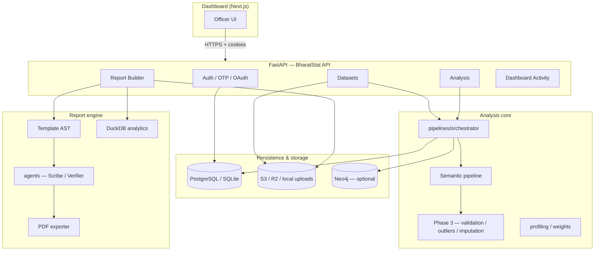

<div align="center">

# BharatStat

**Turn raw statistical datasets into audit-ready intelligence and publication-grade reports.**

[](https://fastapi.tiangolo.com/)
[](https://nextjs.org/)
[](https://www.python.org/)
[](#license)

<br />


</div>


## Table of contents

- [Platform preview](#platform-preview)
- [Overview](#overview)
- [Key capabilities](#key-capabilities)
- [Architecture](#architecture)
- [Technology stack](#technology-stack)
- [Repository layout](#repository-layout)
- [Prerequisites](#prerequisites)
- [Quick start](#quick-start)
- [Configuration](#configuration)
- [Development workflow](#development-workflow)
- [API surface](#api-surface)
- [Analysis pipeline](#analysis-pipeline)
- [Report Builder](#report-builder)
- [Authentication & security](#authentication--security)
- [Testing & quality](#testing--quality)
- [Deployment](#deployment)
- [Operations](#operations)
- [Documentation index](#documentation-index)
- [Contributing](#contributing)
- [License](#license)

---

## Overview

Government and research teams routinely receive heterogeneous CSV/Excel files: inconsistent column names, missing values, outliers, and weak metadata. BharatStat addresses this with:

1. **Deterministic + ML hybrid semantics** — Sentence-transformer embeddings, MoSPI ontology keywords, dynamic domain clusters, and optional Gemini refinement for ambiguous cases.
2. **Candidate-first quality layer** — Validation rules, anomaly detection, and imputation suggestions are stored as **candidates**; officers approve before anything is applied.
3. **Explainable routing** — Every column mapping records confidence, cluster support, graph consistency, and routing path (schema lock, RapidFuzz, embedding similarity, etc.).
4. **Report generation** — Upload a reference PDF template, extract layout/text/tables, map AST blocks to analysis outputs, and export MoSPI-style PDFs with agent-assisted narrative (Scribe + Verifier).
5. **Audit trail** — Activity feed, tamper-evident report artifacts, normalization versioning, and optional Neo4j knowledge-graph sync.

The system is designed for **officer-in-the-loop** workflows: automation proposes; humans decide.

---

## Key capabilities

| Area | What you get |
|------|----------------|
| **Ingestion** | CSV, XLS, XLSX upload (local disk or S3-compatible presigned URLs) |
| **Profiling** | Row/column health, dtype inference, dataset intelligence profiles |
| **Semantic mapping** | Domain taxonomy, ensemble confidence, per-column overrides |
| **Normalization** | Approved column schema versions drive downstream steps |
| **Phase 3 intel** | Rule validation, IQR/Z-score/isolation outliers, imputation candidates |
| **Clustering** | Hierarchical linkage with dataset-size-aware similarity thresholds |
| **Knowledge graph** | Schema blueprint + optional Neo4j sync |
| **Report Builder** | 6-stage PDF template extraction, block mapping, async generation jobs |
| **Dashboard** | Next.js 16 app — upload, analysis wizard, report preview, activity log |

---

## Architecture



**Request flow (analysis):**

1. Officer uploads a dataset → `POST /datasets/upload` (or presigned URL + register).
2. Officer starts analysis → `POST /analysis/{dataset_id}/analyze-async`.
3. Background runner executes `pipelines/orchestrator.run_pipeline` (ingestion → semantic → phase 3 → persistence).
4. Dashboard polls `GET /analysis/{id}/status` and loads `GET /analysis/{id}/results`.
5. Officer walks the 5-step wizard (summary → normalize → semantic → cluster → schema/KG).
6. Optional: Report Builder consumes a **ready** analysis and generates a PDF job.

---

## Technology stack

| Layer | Technologies |
|-------|----------------|
| **Frontend** | Next.js 16, React 19, TypeScript, Tailwind CSS v4, Axios, Sonner |
| **API** | FastAPI, Uvicorn, SQLAlchemy 2, Pydantic v2, python-jose, bcrypt |
| **ML / NLP** | sentence-transformers (`all-MiniLM-L6-v2`), scikit-learn, PyTorch (semantic embeddings) |
| **Data** | pandas, NumPy, SciPy, openpyxl, xlrd, DuckDB adapter (reports) |
| **PDF** | pdfplumber, PyMuPDF, ReportLab |
| **Graph** | Neo4j 5.x (optional), NetworkX |
| **Queue / cache** | Celery, Redis (optional workers) |
| **Object storage** | boto3 — AWS S3, Cloudflare R2, or local paths |
| **Auth** | JWT (httpOnly cookies), OTP email, dev bypass, optional OAuth |

---

## Repository layout

```
statathon/
├── api/                    # FastAPI application (run uvicorn from here)
│   ├── main.py             # App entry, routers, middleware, migrations
│   ├── auth/               # OTP, JWT, CSRF, rate limits
│   ├── dataset_api/        # Upload, profile, effective schema
│   ├── analysis/           # Analysis jobs, results, normalization, KG
│   ├── report_builder_api/ # Template extraction, generation jobs
│   ├── dashboard/          # Aggregated activity feed
│   ├── database/           # SQLAlchemy models & migrations
│   └── services/           # Analysis runner, profiling, persistence
├── dashboard/              # Next.js officer UI
├── agents/                 # Scribe, Verifier, planner, retrieval (reports)
├── pipelines/              # Orchestrator, semantic runner, phase 3
├── model/                  # Semantic mapping, ontology config
├── validation/             # Rule engine, multi-column validators
├── outliers/               # IQR, Z-score, isolation, distribution fit
├── imputation/             # KNN, median, mechanism detection
├── report_builder/         # Template pipeline, firewall, exporter
├── template_engine/        # PDF → AST compilation
├── graph/                  # Neo4j sync & schema bootstrap
├── analytics_engine/       # DuckDB / ClickHouse adapters
├── profiling/              # Dataset & column intelligence
├── docs/                   # Deep-dive guides (env, AWS, report builder)
├── tests/                  # pytest suite
├── docker/                 # API & dashboard Dockerfiles
├── requirements.txt        # Full stack (Linux / GPU-friendly)
└── requirements-windows.txt # Windows-friendly wheels (recommended on Win)
```

---

## Prerequisites

| Requirement | Version / notes |
|-------------|-----------------|
| **Python** | 3.12+ (3.12 recommended; use `requirements-windows.txt` on Windows) |
| **Node.js** | 20+ for the dashboard |
| **Database** | PostgreSQL (production) or SQLite (local hackathon) |
| **Redis** | Optional — only if running Celery workers |
| **Neo4j** | Optional — set `NEO4J_ENABLED=false` to disable KG sync |
| **SMTP** | Required for OTP in production; dev can log OTP to console |

---

## Quick start

### 1. Clone and configure backend

```bash
git clone <repository-url>
cd statathon
python -m venv .venv
```

**Windows (PowerShell):**

```powershell
.\.venv\Scripts\Activate.ps1
pip install -r requirements-windows.txt
```

**Linux / macOS:**

```bash
source .venv/bin/activate
pip install -r requirements.txt
```

### 2. Start the API

From the `api/` directory (required for correct import paths):

```bash
cd api
$env:PYTHONPATH = (Resolve-Path "..").Path   
python -m uvicorn main:app --reload --host 127.0.0.1 --port 8000
```

Verify:

- `GET http://127.0.0.1:8000/health` → `{"status":"ok"}`
- `GET http://127.0.0.1:8000/health/db` → database reachable

Interactive docs: **http://127.0.0.1:8000/docs**

### 3. Start the dashboard

```bash
cd dashboard
cp .env.local.example .env.local
npm install
npm run dev
```

Open **http://localhost:3000**. Sign in with dev credentials from `.env` or complete OTP flow if SMTP is configured.

### 4. Run a sample analysis

1. Go to **Upload** → drop a CSV/XLSX (see `test_data/` for MoSPI-style samples).
2. Open the dataset → **Run analysis**.
3. Open the analysis workspace → complete steps 1–5.
4. Optional: **Report Builder** → pick a ready analysis → extract or clone a template → generate PDF.

---

## Configuration

Environment variables are loaded from **repo root `.env`** when the API starts from `api/`. The dashboard uses `dashboard/.env.local`.

### Essential variables

| Variable | Description |
|----------|-------------|
| `SECRET_KEY` | JWT signing secret (≥32 chars when `AUTH_REQUIRED=true`) |
| `DATABASE_URL` | SQLAlchemy URL (`sqlite:///./statathon.db` or Postgres) |
| `AUTH_REQUIRED` | Enforce authentication (`true` in production) |
| `CORS_ORIGINS` | Comma-separated dashboard origins |
| `UPLOAD_STORAGE_PATH` | Local upload directory (default `./storage/uploads`) |
| `REPORT_STORAGE_PATH` | Generated PDFs and vault JSON |
| `NEO4J_ENABLED` | `true` / `false` — disable if no graph DB |
| `NEO4J_URI`, `NEO4J_USER`, `NEO4J_PASSWORD` | Bolt connection when enabled |
| `HUGGINGFACE_HUB_CACHE` | Model cache dir (default `./model/cache`) |
| `GEMINI_API_KEY` / `GOOGLE_API_KEY` | Optional semantic ambiguity refinement |
| `STORAGE_PROVIDER`, `S3_*` | Presigned uploads (R2/AWS); use `OBJECT_STORAGE_DISABLED=true` locally |

### Dashboard variables

| Variable | Description |
|----------|-------------|
| `NEXT_PUBLIC_API_URL` | Backend base URL (default `http://localhost:8000`) |
| `MAIL_INTERNAL_SECRET` | Shared secret for internal report-email route |
| `SMTP_*` | Nodemailer OTP and report delivery |

**Full reference:** [docs/ENV_SETUP_STEP_BY_STEP.md](docs/ENV_SETUP_STEP_BY_STEP.md)

---

## Development workflow

| Task | Command |
|------|---------|
| API (hot reload) | `cd api && python -m uvicorn main:app --reload --port 8000` |
| Dashboard | `cd dashboard && npm run dev` |
| Lint (frontend) | `cd dashboard && npm run lint` |
| Tests | `python -m pytest tests -v --tb=short` (from repo root) |
| Semantic benchmark | `python scripts/benchmark_semantic_e2e.py` (see testing guide) |

**Import path note:** Always run Uvicorn with `api/` as the working directory so `main:app` resolves and repo-root packages (`pipelines/`, `model/`) import correctly.

On first semantic run, **sentence-transformers** downloads `all-MiniLM-L6-v2` into `HUGGINGFACE_HUB_CACHE` (or `api/model/cache` depending on cwd). Allow a few minutes on a cold start.

---

## API surface

Base URL: `http://localhost:8000` (development)

| Router | Prefix | Responsibility |
|--------|--------|----------------|
| Auth | `/auth` | Login, OTP, refresh, `/me`, CSRF token |
| OAuth | `/auth/oauth` | Optional social login |
| Datasets | `/datasets` | Upload, presigned URL, profile, effective schema |
| Analysis | `/analysis` | Start job, status, results, normalization, domains, clusters, KG |
| Reports | `/reports` | Legacy ingestion PDFs and downloads |
| Report Builder | `/report-builder` | Template extract (async), generate jobs, ready analyses |
| Dashboard | `/dashboard` | Activity feed aggregation |

**Health:**

- `GET /health` — process alive
- `GET /health/db` — SQL connectivity

OpenAPI: `/docs` and `/redoc`

---

## Analysis pipeline

The orchestrator (`pipelines/orchestrator.py`) runs after upload registration:

| Stage | Module | Output |
|-------|--------|--------|
| **Ingestion** | `core/ingestion` | DataFrame, schema, health summary |
| **Profiling** | `profiling/` | Column & dataset intelligence profiles |
| **Semantic** | `pipelines/semantic_runner` | Domain mappings, dynamic clusters, confidence |
| **Phase 3** | `pipelines/phase3_pipeline` | Validation candidates, anomalies, imputation candidates |
| **Persistence** | `api/services/*_persistence_service` | SQL tables + API payload |
| **KG sync** | `graph/neo4j_sync` | Optional graph write |

**Dashboard wizard (5 steps):**

1. **Summary** — health KPIs and pipeline overview  
2. **Normalize** — approve/reject column transformations; versioned effective schema  
3. **Semantic** — domain registry, routing paths, officer overrides  
4. **Cluster** — linkage clusters and cohesion metrics  
5. **Schema & KG** — blueprint preview and knowledge-graph export  

Phase 3 follows a **detect → explain → store → decide** model; see [docs/PHASE3_PIPELINE.md](docs/PHASE3_PIPELINE.md).

---

## Report Builder

Production flow for template-based PDF generation:

1. Select a **ready** analysis (`GET /report-builder/ready-analyses`).
2. Upload a reference PDF or clone the MoSPI default template.
3. **Extract template (async)** — 6-stage pipeline (`report_builder/blueprint.py`): layout, text pages, tables, images → Template AST.
4. Map AST blocks to analysis data sources (`hints.source`).
5. Apply filters (`report_builder/filter_engine.py`).
6. `POST /report-builder/generate` — background job via `report_builder/pipeline.py` (agents, DuckDB kernel, PDF export).
7. Download or deliver (email / webhook).

Architecture detail: [docs/REPORT_BUILDER_ARCHITECTURE.md](docs/REPORT_BUILDER_ARCHITECTURE.md)

---

## Authentication & security

- **JWT access + refresh** tokens in **httpOnly** cookies when using the dashboard.
- **CSRF** double-submit cookie on mutating requests (`CSRF_ENABLED=true`).
- **Rate limiting** on auth endpoints (`AUTH_RATE_MAX_PER_WINDOW`).
- **Security headers** — `X-Content-Type-Options`, `X-Frame-Options`, HSTS in production.
- **RBAC** — datasets, analyses, templates, and jobs scoped to the authenticated officer (`user_id`).
- **Dev mode** — `DEV_AUTH_ENABLED` seeds a test officer; fixed OTP when SMTP is unavailable.

Never commit `.env` or real secrets. Rotate `SECRET_KEY` and database credentials for production.

---

## Testing & quality

```bash
# From repository root
python -m pytest tests -v --tb=short
```

Coverage highlights:

- Analysis state & API payload serialization  
- Semantic adapter and clustering utilities  
- Dataset profiling and ingestion health  
- Storage key conventions  
- JSON-safe numeric handling  

Semantic accuracy benchmarks and relaxed matching rules: [docs/TESTING_FULL_GUIDE.md](docs/TESTING_FULL_GUIDE.md)

---

## Deployment

| Target | Reference |
|--------|-----------|
| **Docker** | `docker/Dockerfile.api`, `docker/Dockerfile.dashboard`, `docker/Dockerfile.api.fargate` |
| **AWS (Fargate, GPU worker, cutover)** | [docs/deploy/aws/README.md](docs/deploy/aws/README.md) |
| **Object storage (R2)** | [docs/R2_STEP_BY_STEP.md](docs/R2_STEP_BY_STEP.md), [docs/OBJECT_STORAGE.md](docs/OBJECT_STORAGE.md) |

## Operations

| Concern | Action |
|---------|--------|
| **Stuck analyses** | API resets orphaned jobs on startup (`services/analysis_runner`) |
| **Neo4j down** | Set `NEO4J_ENABLED=false` or fix Bolt URI; pipeline still completes |
| **PDF extraction fails** | Ensure `pdfplumber` and `PyMuPDF` installed; check job error in Report Builder UI |
| **Large uploads** | Use presigned `POST /datasets/upload-url` + `register` |
| **Logs** | Uvicorn stdout; request logging middleware in `api/main.py` |

Local artifact paths (gitignored): `storage/uploads/`, `storage/reports/`, `api/storage/` when running from `api/`.

---

## Documentation index

| Document | Topic |
|----------|--------|
| [docs/ENV_SETUP_STEP_BY_STEP.md](docs/ENV_SETUP_STEP_BY_STEP.md) | Every `.env` variable explained |
| [docs/PHASE3_PIPELINE.md](docs/PHASE3_PIPELINE.md) | Validation, outliers, imputation |
| [docs/REPORT_BUILDER_ARCHITECTURE.md](docs/REPORT_BUILDER_ARCHITECTURE.md) | Report engine phases |
| [docs/TESTING_FULL_GUIDE.md](docs/TESTING_FULL_GUIDE.md) | pytest, benchmarks, troubleshooting |
| [docs/SEMANTIC_PLATFORM_INPUTS.md](docs/SEMANTIC_PLATFORM_INPUTS.md) | Semantic layer inputs |
| [docs/OBJECT_STORAGE.md](docs/OBJECT_STORAGE.md) | S3-compatible storage |
| [docs/deploy/aws/README.md](docs/deploy/aws/README.md) | AWS deployment runbooks |
| [dashboard/README.md](dashboard/README.md) | Frontend-specific setup |

---

<p align="center">
  <strong>BharatStat</strong> — from raw tables to trusted insight and publishable reports.
</p>
