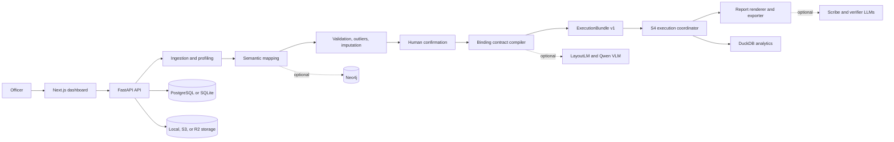
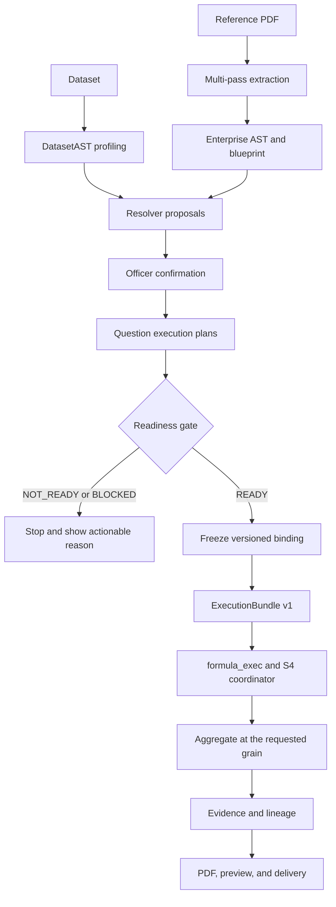
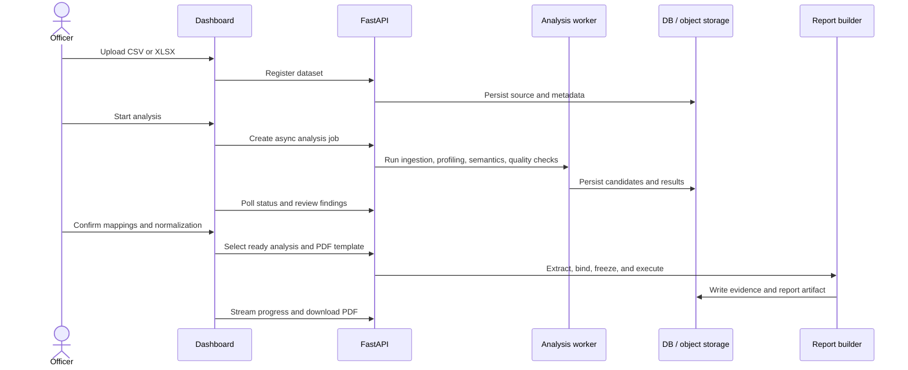
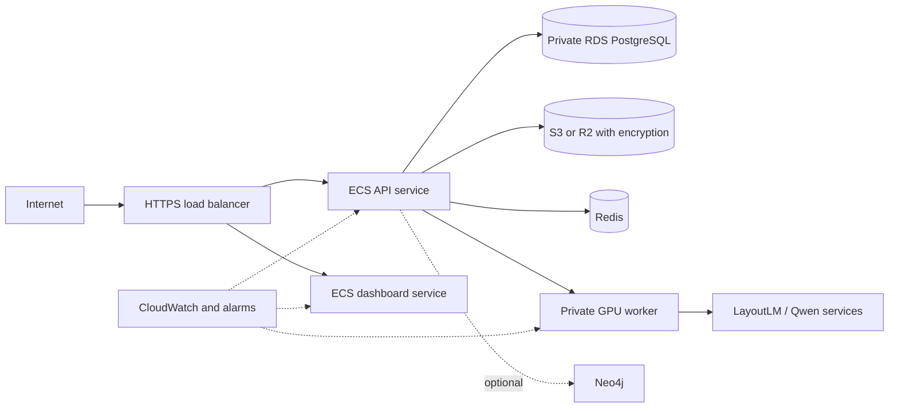

<div align="center">

# BharatStat

**Audit-ready intelligence and publication-grade reports from raw statistical data.**

[](https://fastapi.tiangolo.com/)
[](https://nextjs.org/)
[](https://www.python.org/)
[](docs/BINDING_AND_EXTRACTION_ARCHITECTURE.md)

<br />


</div>

## What BharatStat does

BharatStat helps government and research teams turn heterogeneous CSV and Excel files, together with reference PDF reports, into explainable analysis and reusable reports. It combines deterministic data engineering with optional machine learning and language-model services. The workflow remains officer-in-the-loop: the system proposes mappings, quality actions, and report bindings; a user confirms decisions before they become operational.

### Core capabilities

| Capability | Outcome |
| --- | --- |
| Ingestion | CSV, XLS, and XLSX uploads from local or S3-compatible storage |
| Profiling | Dataset health, types, cardinality, ranges, units, and column roles |
| Semantic mapping | Ontology and embedding-assisted domain mapping with evidence and confidence |
| Quality intelligence | Validation findings, outlier signals, and imputation candidates for review |
| Analysis workspace | Normalization, domains, clusters, schema blueprint, and knowledge graph views |
| Template extraction | PDF layout and semantic structure compiled into an Enterprise AST |
| Contract binding | Confirmed `ExecutionBundle` plans with readiness, severity, freeze, and lineage controls |
| Report generation | Filtered analytics, verified narrative, charts, tables, and MoSPI-style PDF export |
| Auditability | Evidence references, provenance, versioned artifacts, and activity history |

## Architecture



### Data and report lifecycle



The binding contract is the handoff between interpretation and execution. The renderer consumes physical columns and confirmed plans; formulas such as shares, rates, ratios, growth, CAGR, and index values are computed by `formula_exec` before rendering. This prevents the renderer from silently reinterpreting a loose binding or formula string.

## Technology stack

| Layer | Technology |
| --- | --- |
| Frontend | Next.js 16, React 19, TypeScript, Tailwind CSS 4 |
| API | FastAPI, Uvicorn, SQLAlchemy 2, Pydantic 2 |
| Data and statistics | pandas, NumPy, SciPy, scikit-learn, DuckDB |
| Semantic intelligence | Sentence Transformers, ontology rules, optional LLM providers |
| Documents | pdfplumber, PyMuPDF, ReportLab, LayoutLMv3, optional Qwen VLM |
| Persistence | PostgreSQL or SQLite, Redis, local disk or S3/R2 |
| Knowledge graph | Neo4j 5.x (optional) |
| Deployment | Docker Compose locally; ECS, RDS, S3, and optional GPU worker on AWS |

## Repository map

```text
api/                 FastAPI application, routers, auth, services, persistence
dashboard/           Next.js officer dashboard
pipelines/           Analysis orchestration and semantic runner
core/                Ingestion and shared data processing
profiling/           Dataset and column intelligence
validation/          Rule validation and multi-column checks
outliers/            IQR, Z-score, isolation, and distribution analysis
imputation/          Missing-value candidates and mechanism detection
report_builder/      Extraction, binding, execution, narrative, and export
template_engine/     PDF-to-AST template compiler
ast_core/            Enterprise document AST and rendering primitives
analytics_engine/    DuckDB, ClickHouse, and Cube adapters
agents/              Planner, retrieval, scribe, verifier, and consensus agents
graph/               Neo4j synchronization and graph utilities
tests/               Offline and service-backed tests
scripts/             Smoke tests, benchmarks, and operations helpers
docs/                Architecture, setup, testing, storage, and deployment guides
```

## Quick start

### Prerequisites

- Python 3.12 or newer
- Node.js 20 or newer
- Git
- PostgreSQL for a production-like setup, or SQLite for a lightweight local run
- Docker Desktop only when Redis, Neo4j, LayoutLM, or GPU services are needed

On Windows, use `requirements-windows.txt`. On Linux or macOS, use `requirements.txt`.

### 1. Install the backend

```powershell
git clone https://github.com/Madan94/statathon.git
cd statathon
python -m venv .venv
.\.venv\Scripts\Activate.ps1
python -m pip install -r requirements-windows.txt
Copy-Item .env.example .env
```

For Linux or macOS:

```bash
python3 -m venv .venv
source .venv/bin/activate
python -m pip install -r requirements.txt
cp .env.example .env
```

For the fastest offline smoke test, set these values in `.env`:

```env
LLM_DISABLED=1
NEO4J_ENABLED=false
OBJECT_STORAGE_DISABLED=true
DATABASE_URL=sqlite:///./statathon.db
AUTH_REQUIRED=false
```

Never commit `.env`, credentials, model weights, or generated audit artifacts.

### 2. Start the API

From the repository root:

```powershell
cd api
$env:PYTHONPATH = (Resolve-Path "..").Path
python -m uvicorn main:app --reload --host 127.0.0.1 --port 8000
```

Useful endpoints:

- Health: `http://127.0.0.1:8000/health`
- Database health: `http://127.0.0.1:8000/health/db`
- OpenAPI: `http://127.0.0.1:8000/docs`

### 3. Start the dashboard

```powershell
cd dashboard
Copy-Item .env.local.example .env.local -ErrorAction SilentlyContinue
npm install
npm run dev
```

Open `http://localhost:3000`. Set `NEXT_PUBLIC_API_URL` in `dashboard/.env.local` when the API is not running at `http://localhost:8000`.

### 4. Start optional services

```powershell
# Redis and Neo4j
docker compose up -d redis neo4j

# LayoutLM and Qwen VLM; requires an NVIDIA GPU and Docker GPU support
docker compose --profile gpu up -d
```

| Service | Port | Required? |
| --- | ---: | --- |
| Dashboard | 3000 | For the web UI |
| FastAPI | 8000 | Yes |
| LayoutLM | 8001 | Optional; PDF layout extraction |
| Qwen VLM / SGLang | 8002 | Optional; vision extraction |
| Neo4j | 7474 / 7687 | Optional; knowledge graph |
| Redis | 6379 | Optional; cache and workers |

## Configuration

`.env.example` is the configuration reference. The most important production settings are:

| Variable | Purpose | Production guidance |
| --- | --- | --- |
| `SECRET_KEY` | JWT signing | Use a long random secret from a secret manager |
| `AUTH_REQUIRED` | Protects authenticated routes | `true` |
| `DATABASE_URL` | SQL database connection | PostgreSQL with TLS |
| `CORS_ORIGINS` | Allowed dashboard origins | Exact HTTPS origins only |
| `OBJECT_STORAGE_DISABLED` | Local versus object storage | `false` with S3/R2 configured |
| `IMMUTABLE_VAULT_REQUIRED` | Protects report/template artifacts | `true` |
| `NEO4J_ENABLED` | Knowledge graph sync | Enable only when configured |
| `LLM_DISABLED` | Deterministic offline mode | `1` for tests and air-gapped operation |
| `VLM_PROVIDER`, `REASONING_PROVIDER` | Model routing | Configure through environment only |
| `SGLANG_ENDPOINT`, `LAYOUTLM_ENDPOINT` | Vision service endpoints | Private service URLs in deployment |

All model calls should go through `report_builder.llm_router`; model names and endpoints belong in environment configuration, not Python source.

## End-to-end workflow



## Report Builder contract

The production report path is deliberately staged:

| Stage | Responsibility | Representative code |
| --- | --- | --- |
| S0 | Profile dataset and identify roles | `report_builder/binding/` |
| S1 | Resolve entities to dataset columns | `report_builder/binding/` |
| S2 | Capture human confirmation | Dashboard and binding state |
| S3 | Compile question execution plans | Binding compiler |
| S3.5 | Enforce readiness and severity gates | Binding readiness gate |
| Freeze | Persist immutable, versioned binding | Freeze store |
| S4 | Execute confirmed plans and formulas | Execution coordinator / `formula_exec` |
| S5-S6 | Verify content and render output | Firewall, agents, exporter |

Important invariants:

- `NOT_READY` blocks generation.
- `BLOCKED` plans, such as a missing denominator or base value, are not softened into runnable degradation.
- Shares, rates, and ratios aggregate numerator and denominator at the same grain before division.
- `reported_value` never silently falls back to `mean()` when values disagree.
- Freeze keys use `BindingAST.datasetSignature`.
- Multi-measure plans preserve stable plan IDs, slots, and lineage.

See [BINDING_AND_EXTRACTION_ARCHITECTURE.md](docs/BINDING_AND_EXTRACTION_ARCHITECTURE.md), [REPORT_BUILDER_ARCHITECTURE.md](docs/REPORT_BUILDER_ARCHITECTURE.md), and [report_builder/gold_standard/README.md](report_builder/gold_standard/README.md).

## Benchmarks and quality gates

Benchmarks are diagnostic evaluations, not production SLAs. Results vary with CPU/GPU, model-cache state, dataset shape, ontology configuration, and whether profiling is enabled.

### Reproduce semantic benchmarks

```powershell
# Synthetic end-to-end benchmark, direct semantic pipeline
python scripts\benchmark_semantic_e2e.py

# Full HTTP path with upload, profiling, and persistence
python scripts\benchmark_semantic_e2e.py --http

# Holdout dataset benchmark
python scripts\benchmark_holdout.py --dataset "test_data\Economics - MoSPI.csv"

# Header-drift resilience benchmark
python scripts\benchmark_resilience.py --dataset "test_data\Economics - MoSPI.csv"
```

### Representative documented results

The following values are from the repository testing guide and should be refreshed when models, ontology, or pipeline thresholds change:

| Scenario | Metric | Representative result | Interpretation |
| --- | --- | ---: | --- |
| Direct synthetic pipeline, 10 columns | Exact match | 30% (3/10) | Strict ontology label match |
| Direct synthetic pipeline, 10 columns | Relaxed match | 70% (7/10) | Includes valid dynamic-domain matches |
| Direct synthetic pipeline | Wall time | About 3.5 s | Warm model cache |
| Full HTTP path | Analyze time | About 113 s | First MiniLM load and profiling included |
| Full HTTP path, 10 columns | Exact match | 10% (1/10) | Profile-derived embeddings change results |
| Full HTTP path, 10 columns | Relaxed match | 50% (5/10) | Diagnostic, not an SLA |

The automated suite is the primary regression gate:

```powershell
python -m pytest -m "not live" -q
```

For the full local suite and benchmark interpretation, see [docs/TESTING_FULL_GUIDE.md](docs/TESTING_FULL_GUIDE.md). For frontend checks:

```powershell
cd dashboard
npm run lint
npm run build
```

## API surface

| Area | Prefix | Examples |
| --- | --- | --- |
| Authentication | `/auth` | Login, OTP, refresh, current user |
| Datasets | `/datasets` | Upload, registration, profiles, effective schema |
| Analysis | `/analysis` | Jobs, status, results, normalization, graph |
| Reports | `/reports` | Legacy report ingestion and downloads |
| Report Builder | `/report-builder` | Templates, generation jobs, progress, downloads |
| Dashboard | `/dashboard` | Activity and aggregate views |

The generated OpenAPI document at `/docs` is the authoritative request/response reference.

## Production deployment

The supported production shape separates the web/API plane from optional GPU inference:



Production checklist:

- Store secrets in AWS Secrets Manager or an equivalent secret manager.
- Use PostgreSQL, TLS, backups, connection limits, and migration controls.
- Use S3/R2 with least-privilege credentials, encryption, and immutable report-vault policy.
- Set `AUTH_REQUIRED=true`, `COOKIE_SECURE=true`, strict CORS, and a real SMTP provider.
- Keep GPU services private; expose only the API/dashboard through the load balancer.
- Run `/health` and `/health/db` checks and the production smoke script before cutover.
- Monitor API errors, job failures, queue depth, database health, and p95 latency.

Deployment runbooks are in [docs/deploy/aws/README.md](docs/deploy/aws/README.md). Object storage setup is documented in [docs/R2_STEP_BY_STEP.md](docs/R2_STEP_BY_STEP.md).

## Security and operational notes

- Treat uploaded datasets, generated reports, API keys, and audit logs as sensitive.
- Do not commit `.env*`, `audit_log.json`, model weights, or cache contents.
- Keep `LLM_DISABLED=1` for deterministic air-gapped tests and environments without model services.
- Optional services degrade only where the pipeline contract permits it; readiness failures must remain visible.
- Rotate leaked credentials immediately and review object-storage and database access logs.

## Documentation index

| Guide | Use it for |
| --- | --- |
| [ENV_SETUP_STEP_BY_STEP.md](docs/ENV_SETUP_STEP_BY_STEP.md) | Environment variables and provider setup |
| [TESTING_FULL_GUIDE.md](docs/TESTING_FULL_GUIDE.md) | Tests, benchmarks, and failure diagnosis |
| [BINDING_AND_EXTRACTION_ARCHITECTURE.md](docs/BINDING_AND_EXTRACTION_ARCHITECTURE.md) | Extraction and `ExecutionBundle` contract |
| [REPORT_BUILDER_ARCHITECTURE.md](docs/REPORT_BUILDER_ARCHITECTURE.md) | Report phases, analytics, and delivery |
| [R2_STEP_BY_STEP.md](docs/R2_STEP_BY_STEP.md) | Cloudflare R2 configuration |
| [docs/deploy/aws/README.md](docs/deploy/aws/README.md) | AWS deployment and rollback runbooks |
| [GUIDE.md](GUIDE.md) | Project usage notes |

## Contributing

1. Create a focused branch from `main`.
2. Keep configuration and secrets out of source control.
3. Add or update focused tests for behavior changes.
4. Run the offline test suite and relevant frontend checks.
5. Update architecture or operational documentation when contracts change.

The binding and extraction contract is shared infrastructure. Changes there should include contract tests and a concise change note.

## License

This repository was created for the Statathon project. Add the project-approved license text here before distributing the software outside the owning organization.
