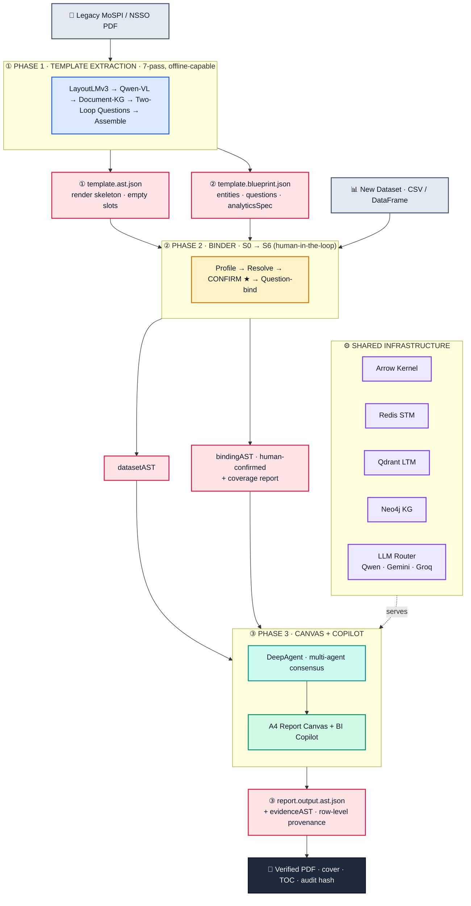
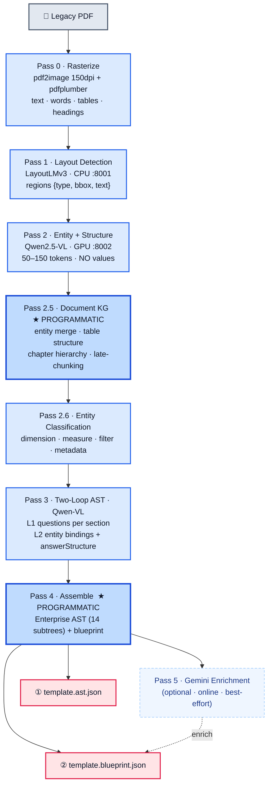
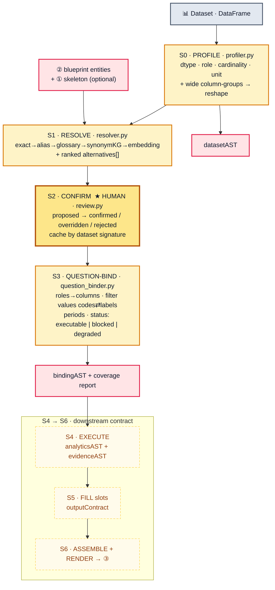
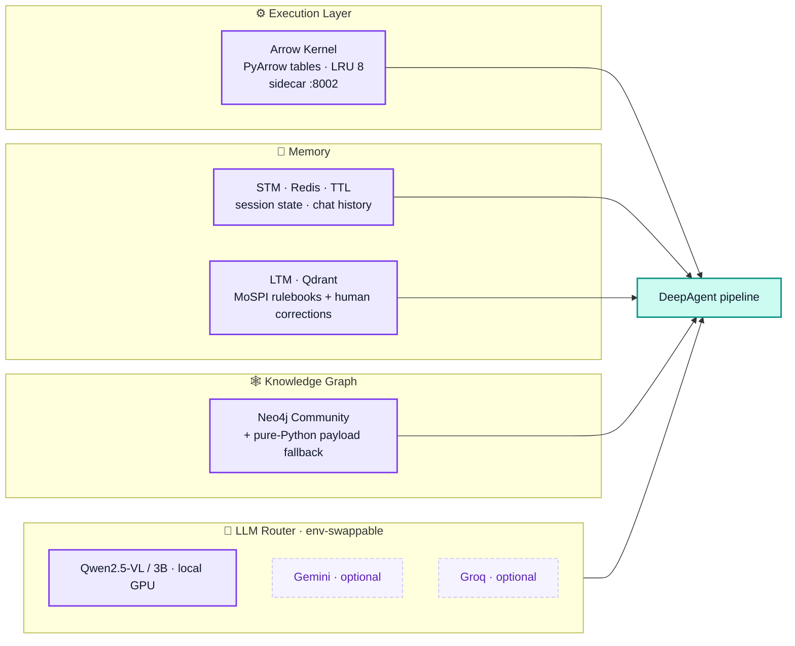
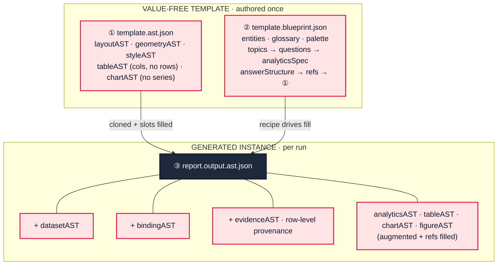

# BharatStat V2 — Architecture Diagrams (Presentation Pack)

> Two formats per diagram:
> - **Mermaid** — renders directly in VS Code / GitHub / most slide tools.
> - **Eraser.io DSL** — paste into <https://app.eraser.io> → *Diagram as Code* for the premium, icon-rich look.

Color legend: **Inputs** gray · **Phase 1 Extraction** blue · **Phase 2 Binder** amber · **Phase 3 Canvas/Copilot** green · **Agents** teal · **Infrastructure** purple · **Artifacts** rose · **Output** dark.

---

## 1 — Hero: End-to-End System Architecture (Mermaid)



### Hero — Eraser.io DSL

```eraser
title BharatStat V2 — End-to-End Architecture

Legacy PDF [icon: file-text, color: gray]
New Dataset [icon: database, color: gray]

Phase 1 — Template Extraction [color: blue, icon: scan] {
  Pass 0 Rasterize [icon: image]
  Pass 1 LayoutLMv3 [icon: layout]
  Pass 2 Qwen-VL Entities [icon: eye]
  Pass 2.5 Document KG [icon: git-branch]
  Pass 3 Two-Loop Questions [icon: help-circle]
  Pass 4 Assemble AST [icon: package]
}

Value-Free Template [color: red, icon: file-code] {
  template.ast.json — skeleton [icon: layout-template]
  template.blueprint.json — brain [icon: cpu]
}

Phase 2 — Binder [color: orange, icon: link] {
  S0 Profile [icon: search]
  S1 Resolve cascade [icon: shuffle]
  S2 Confirm — HUMAN [icon: user-check]
  S3 Question-Bind [icon: check-circle]
}

Bound Artifacts [color: red, icon: shield] {
  datasetAST [icon: database]
  bindingAST [icon: git-merge]
}

Phase 3 — Canvas + Copilot [color: green, icon: edit-3] {
  DeepAgent Consensus [icon: cpu]
  A4 Report Canvas [icon: file-text]
  BI Copilot [icon: message-square]
}

Infrastructure [color: purple, icon: server] {
  Arrow Kernel [icon: zap]
  Redis STM [icon: clock]
  Qdrant LTM [icon: book-open]
  Neo4j KG [icon: share-2]
  LLM Router [icon: git-pull-request]
}

Output [color: gray, icon: file-output] {
  report.output.ast.json [icon: file]
  evidenceAST — row-level [icon: list]
  Verified PDF [icon: file-text]
}

Legacy PDF > Phase 1 — Template Extraction
Phase 1 — Template Extraction > Value-Free Template
Value-Free Template > Phase 2 — Binder
New Dataset > Phase 2 — Binder
Phase 2 — Binder > Bound Artifacts
Bound Artifacts > Phase 3 — Canvas + Copilot
Infrastructure > Phase 3 — Canvas + Copilot: serves
Phase 3 — Canvas + Copilot > Output
```

---

## 2 — Phase 1: Template Extraction (7-pass)



### Phase 1 — Eraser.io DSL

```eraser
title Phase 1 — Template Extraction (7-pass)

Legacy PDF [icon: file-text, color: gray]

Pass 0 Rasterize [color: blue, icon: image]
Pass 1 LayoutLMv3 (CPU :8001) [color: blue, icon: layout]
Pass 2 Qwen-VL Entities (GPU :8002) [color: blue, icon: eye]
Pass 2.5 Document KG — PROGRAMMATIC [color: blue, icon: git-branch]
Pass 2.6 Entity Classification [color: blue, icon: tag]
Pass 3 Two-Loop Questions [color: blue, icon: help-circle]
Pass 4 Assemble AST + Blueprint [color: blue, icon: package]
Pass 5 Gemini Enrich (optional) [color: gray, icon: sparkles]

template.ast.json [color: red, icon: layout-template]
template.blueprint.json [color: red, icon: cpu]

Legacy PDF > Pass 0 Rasterize > Pass 1 LayoutLMv3 (CPU :8001) > Pass 2 Qwen-VL Entities (GPU :8002)
Pass 2 Qwen-VL Entities (GPU :8002) > Pass 2.5 Document KG — PROGRAMMATIC > Pass 2.6 Entity Classification
Pass 2.6 Entity Classification > Pass 3 Two-Loop Questions > Pass 4 Assemble AST + Blueprint > Pass 5 Gemini Enrich (optional)
Pass 4 Assemble AST + Blueprint > template.ast.json
Pass 4 Assemble AST + Blueprint > template.blueprint.json
Pass 5 Gemini Enrich (optional) > template.blueprint.json: enrich
```

---

## 3 — Phase 2: Binder (S0 → S6)



### Phase 2 — Eraser.io DSL

```eraser
title Phase 2 — Binder (S0 to S6)

blueprint + skeleton [icon: file-code, color: red]
Dataset DataFrame [icon: database, color: gray]

Binder [color: orange, icon: link] {
  S0 Profile [icon: search]
  S1 Resolve cascade [icon: shuffle]
  S2 Confirm — HUMAN [icon: user-check]
  S3 Question-Bind [icon: check-circle]
}

Outputs [color: red, icon: shield] {
  datasetAST [icon: database]
  bindingAST + coverage [icon: git-merge]
}

Downstream Contract [color: gray, icon: clock] {
  S4 Execute — analyticsAST + evidenceAST [icon: cpu]
  S5 Fill slots — outputContract [icon: edit]
  S6 Assemble + Render [icon: package]
}

Dataset DataFrame > S0 Profile
blueprint + skeleton > S1 Resolve cascade
S0 Profile > S1 Resolve cascade > S2 Confirm — HUMAN > S3 Question-Bind
S0 Profile > datasetAST
S3 Question-Bind > bindingAST + coverage
bindingAST + coverage > S4 Execute — analyticsAST + evidenceAST
```

---

## 4 — Phase 3: DeepAgent Consensus + Canvas/Copilot

```mermaid
flowchart LR
    Q["Officer question /<br/>generate request"]:::input

    subgraph AGENTS["DeepAgent · Multi-Agent Consensus Pipeline"]
        direction TB
        PL["PlannerAgent<br/>11 intents · domain hints"]:::agent
        RT["RetrievalAgent<br/>5 sources · parallel"]:::agent
        AN["AnalyticsAgent<br/>agg · corr · trend · forecast · test"]:::agent
        SC["ScribeAgent<br/>grounded · anti-hallucination"]:::agent
        VR["VerifierAgent<br/>recompute every numeric claim"]:::agent
        CE{"ConsensusEngine<br/>verdict = pass?"}:::agenthot
        PL --> RT --> AN --> SC --> VR --> CE
        CE -->|fail · retry ≤ 3| SC
        CE -->|exhausted| DET["Deterministic fallback"]:::agent
    end

    BLK["RenderedBlock<br/>narrative · table · chart · metric<br/>+ verifier badge + provenance"]:::artifact
    CANVAS["A4 Report Canvas<br/>§-numbering · pagination · table-split"]:::p3
    CHAT["BI Copilot<br/>13-tool router → drag-to-insert"]:::p3

    Q --> PL
    CE -->|pass| BLK
    DET --> BLK
    BLK --> CANVAS & CHAT

    classDef input fill:#E2E8F0,stroke:#475569,color:#0F172A,stroke-width:2px
    classDef agent fill:#CCFBF1,stroke:#0D9488,color:#0F172A,stroke-width:2px
    classDef agenthot fill:#99F6E4,stroke:#0F766E,color:#0F172A,stroke-width:3px
    classDef p3 fill:#D1FAE5,stroke:#059669,color:#0F172A,stroke-width:2px
    classDef artifact fill:#FFE4E6,stroke:#E11D48,color:#0F172A,stroke-width:2px
```



### Phase 3 — Eraser.io DSL

```eraser
title Phase 3 — DeepAgent Consensus + Canvas / Copilot

Officer Request [icon: message-circle, color: gray]

DeepAgent Consensus [color: green, icon: cpu] {
  PlannerAgent [icon: git-branch]
  RetrievalAgent [icon: search]
  AnalyticsAgent [icon: bar-chart]
  ScribeAgent [icon: edit-3]
  VerifierAgent [icon: shield]
  ConsensusEngine [icon: refresh-cw]
  Deterministic Fallback [icon: anchor]
}

RenderedBlock [color: red, icon: box]
A4 Report Canvas [color: green, icon: file-text]
BI Copilot [color: green, icon: message-square]

Officer Request > PlannerAgent
PlannerAgent > RetrievalAgent > AnalyticsAgent > ScribeAgent > VerifierAgent > ConsensusEngine
ConsensusEngine > ScribeAgent: fail · retry <= 3
ConsensusEngine > Deterministic Fallback: exhausted
ConsensusEngine > RenderedBlock: pass
Deterministic Fallback > RenderedBlock
RenderedBlock > A4 Report Canvas
RenderedBlock > BI Copilot
```

---

## 5 — Infrastructure & Data Stores



---

## 6 — The 3-File Data Model (intellectual core)



---

## How to use these in the deck

1. **Slide 4 (overview):** Diagram 1 (Hero). Use the Eraser DSL for the polished, icon-rich render.
2. **Slides 5–7:** Diagram 2 (Phase 1).
3. **Slides 8–9:** Diagram 3 (Phase 2) — emphasise the ★ HUMAN confirm node.
4. **Slides 10–12:** Diagram 4 (agents) + Diagram 5 (infra).
5. **Slide 3 (big idea):** Diagram 6 (3-file model).

**Premium-render tip:** in Eraser.io, after pasting, set *Theme → Clean/Dark*, enable *Rounded* nodes, and export at 2× PNG/SVG for crisp slides.
