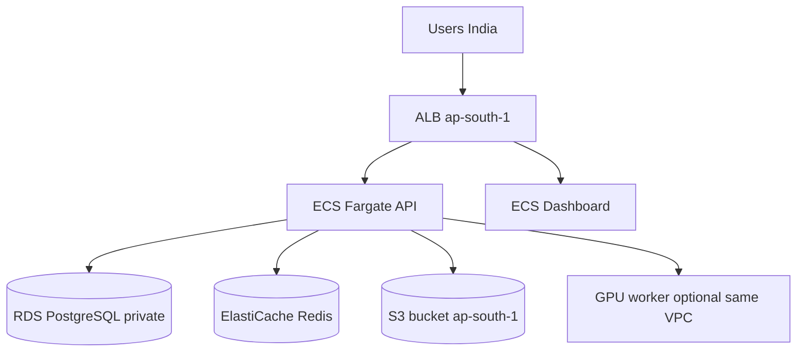

# ap-south-1 Co-location Checklist (Production)

For best latency in India, run **ECS, RDS, ElastiCache Redis, and S3 in the same region** (`ap-south-1` Mumbai). Cross-region hops (e.g. API in Mumbai + S3 in us-east-1) add latency and data transfer cost.

## Target architecture



## Pre-deploy alignment checklist

- [ ] **AWS region** set to `ap-south-1` for all resources below
- [ ] **RDS PostgreSQL 16** in private subnets; SG allows 5432 from `sg-ecs-api` only
- [ ] **ElastiCache Redis** in private subnets; SG allows 6379 from `sg-ecs-api`
- [ ] **S3 bucket** in `ap-south-1` with SSE-KMS (see [07-s3-datasets-kms.md](./07-s3-datasets-kms.md))
- [ ] **ECS Fargate** API + dashboard in private subnets behind ALB
- [ ] **`DATABASE_URL`** in Secrets Manager pointing at private RDS endpoint
- [ ] **`AWS_REGION=ap-south-1`** and **`S3_KMS_KEY_ID`** in same region as bucket
- [ ] **`REDIS_URL`** pointing at ElastiCache endpoint (not localhost)
- [ ] Task IAM role has S3 + KMS permissions for the Mumbai bucket (no long-lived access keys in tasks if avoidable)

## Environment matrix (production)

| Variable | Production value |
|----------|------------------|
| `AWS_REGION` | `ap-south-1` |
| `S3_BUCKET` | `your-bucket-ap-south-1` |
| `S3_KMS_KEY_ID` | `arn:aws:kms:ap-south-1:ACCOUNT:key/...` |
| `DATABASE_URL` | `postgresql://...@*.ap-south-1.rds.amazonaws.com:5432/statathon?sslmode=require` |
| `REDIS_URL` | `redis://*.cache.amazonaws.com:6379/0` |
| `DB_POOL_SIZE` | `5`–`10` per API task |
| `DB_STATEMENT_TIMEOUT_MS` | `30000` |

Full ECS env mapping: [02-env-secrets-matrix.md](./02-env-secrets-matrix.md).

## Migrating S3 from us-east-1

If datasets currently live in a Virginia bucket:

1. Create new bucket in `ap-south-1` with KMS key in same region.
2. Sync objects: `aws s3 sync s3://old-bucket s3://new-bucket-ap-south-1 --source-region us-east-1`
3. Update `S3_BUCKET`, `AWS_REGION`, `S3_KMS_KEY_ID` in production secrets.
4. Re-run `scripts/migrate_local_datasets_to_s3.py` only if DB rows still reference old keys.

DB metadata (analyses, validation rows) stays in RDS; object keys in `datasets` table must match the new bucket/prefix.

## Dev vs production regions

| Environment | Database | S3 region | Notes |
|-------------|----------|-----------|-------|
| Local dev | Docker `localhost:5432` | Any (latency on file I/O) | Fastest DB; S3 still remote |
| Staging | RDS Mumbai + SSM tunnel | Prefer `ap-south-1` | Shared team DB |
| Production | RDS private in VPC | **`ap-south-1`** | All services co-located |

## Cutover verification

After deploy, run checks from [05-cutover-checklist.md](./05-cutover-checklist.md):

```powershell
python scripts/aws/smoke_production.py --base-url https://your-domain
```

Confirm `/health/db` shows RDS endpoint (redacted in logs), `ping_ms` low inside VPC (<5 ms typical).

## Rollback

1. Revert ECS task definition to previous revision.
2. Revert Route53 to previous ALB if DNS was switched.
3. Restore RDS from snapshot only if data corruption occurred — not needed for app-only rollbacks.
